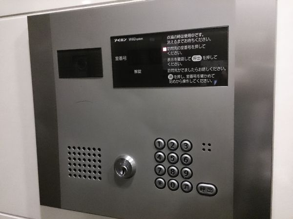

# アイ○ンをハックする

　こんにちは， binzume です．ここ1年くらい仕事でErlang開発をしていたので，WindowsでErlang開発する話を書く予定でしたが，国内シェアの高いみんな大好きなアイ○ンの話を書きます．ちなみに筆者はAndroid派です．


# よくある話

　コンビニに行って，家に戻るとマンションのエントランスで家の鍵を持っていないことに気付きます．鍵は家の中＝部屋の鍵は開いている，ということなのですが，マンションのエントランスにあるこいつが通行を阻みます．



　拡大．


　こんなとき，フィクションの世界なら，凄腕のハッカーが現れて怪しいカードをスリットに挿しこみ，接続された端末に謎の文字列がしばらく流れると，ドアが開くのですが，残念ながら都合よくそんなハッカーが現れないし，そもそもカードを挿すスリットもありません．また，多くの場合，管理会社や不動産会社が使う番号が設定されていたりするのですが，不正アクセス禁止法とか色々面倒な世の中なのでおとなしく退散します．そして周りの目を気にしながらフェンスによじ登り非常階段から２階に上がりエレベータに乗る日々を送っています．

```
注意： 上記は全てフィクションです
```

# 室内端末

　エントランスで怪しいことやってると変な誤解をされて通報される危険性があるので，部屋の中で作業します．


　「通話/終話」ボタンを手前に引くとネジがあるので，それを回せば簡単に開きます．


　あとは，パネルの裏に配線の説明が書いてあるので「データ」と書いてある２本の線を探します．

## オシロスコープで眺める

　おそらく差動信号なのでデータの線の間の電圧をオシロで測ってみます．


　画面では振幅が見えていますが実際には周波数で変調されています．

- 2値で構成されたデータを送っている → きっとデジタルデータ
- 0,1が切り替わる時間は離散的で最短の部分が 約0.83ms → 1200bps
- クロックらしき信号はない → 調歩同期シリアルっぽい
- スタートビットはどこか
- スタートビット + 8ビットと仮定すると同期が取れない → パリティついてそう
- 以下略

という感じで画面をしばらく眺めていれば，送受信されているデータの意味はなんとなくわかってくると思います．
ただ，２値のうちどちらが0でどちらが1であるかは分からず，最初は本来とは逆に認識していてデータのバイト列を眺めてる最中にやっと何か変だと気付きました．


振幅が小さい部分が約51kHzで，データの 0 を表し，振幅の大きい部分が約68kHzで，データの 1 を表しています．

上記の写真の信号をそのまま読み取ると，左から `11000000010100110000101101..` に見えます．

スタートビットが0なので先頭の11の部分は意味はなく，その後を区切っていくと，

```
+----+----+----------+---+----+----+----------+---+----+-----+----------+
| -- | ST | DATA     | P | -- | ST | DATA     | P | -- | ST  | DATA...  |
| 11 | 0  | 00000010 | 1 |    | 0  | 01100001 | 0 | 11 | 0   |  ...     |
+----+----+----------+---+----+----+----------+---+----+-----+----------+
```

となりそうです．(`--` で書かれた場所の長さは不定です)

40h 86h からはじまるメッセージだとわかります．


# プロトコル

[メッセージタイプ], [部屋番号], [データ...],[チェックサム] という共通のフォーマットでデータを送受信しています．

```
+--------------+----------+--------------------------+--------------+
| Message Type | Room No. |  Data                    | Check Sum    |
|  1B          |  1B      |   0...NB                 |  1B          |
+--------------+----------+--------------------------+--------------+
```


# 通信

　主にデータと映像/音声の２系統あります．

## データ

　ごく普通のシリアル通信を周波数変調したものです．

- 差動信号．±5V(？)
- 変調周波数 50～70kHz
- 1200bps, スタートビット0, データ8ビット, 偶数パリティ, LSBから

## 映像/音声

- NTSCのようなもの
- そのまま再生できそうな信号が流れてますが，確認はしてないです


### Message Type

メッセージ先頭の8ビット．

| Type | 方向             |  説明                       |
| ---- | ---------------- | --------------------------- |
| 40h  | エントランス→部屋 |  リクエスト/レスポンス    |
| c0h  | エントランス→部屋 |  リクエスト/レスポンス    |
| 50h  | エントランス→部屋 |  ACK (データ長は0)        |
| d0h  | エントランス→部屋 |  ACK (データ長は0)        |

おそらくMSB1ビットは室内の端末から送られたときに1になります．


### Room No.

下位4ビットが階数，上位4ビットにその階の番号が入っていました．階ごとの部屋数など構成によって違うと思います．

### Data

0 バイト以上のデータです．長さはデータの種類ごとに決まっているようです．内容は後述．

### Check Sum

チェックサムを含めて，メッセージ全体のバイトごとの和の下位8ビットが0になります．

## 送受信されるメッセージ

　色々なメッセージが流れていますが，代表的なものを説明していきます．宅配ボックスもつながってるみたいですが，テストしにくいので未調査です．

### 定期的なポーリング

　1部屋/10秒くらいでPING/PONG的な通信をしているようです．部屋番号が飛び飛びなので，たぶんバスが複数に分かれています．

- → 40h Room 68h CHKSUM
- ← d0h Room CHKSUM (ACK)
- ← c0h Room 69h 21h CHKSUM
- → 50h Room CHKSUM (ACK)

(右向き矢印(→)がエントランスから室内端末，左向き矢印(←)が室内端末からエントランスへのメッセージ)

なんとなく，69hが68hに対する返答を表し，もしかしたら21hは固定ではないのではないかと思いますが，よくわかりません．メッセージを受け取ると，必ずACK的なものを返すようです．なにも返さないと何度かリトライしていそうです．

### エントランス解錠

　通話中に送信します．マンションのエントランスのドアが開きます．

- ← c0h Room 45h 8ch CHKSUM
- → 50h Room CHKSUM (ACK)

　通話中のテストはエントランスに人がいないと出来ないのですが，事前にエレベータを1Fに呼んだ上でエントランスからダッシュすればタイムアウト前にギリギリ部屋にたどり着けました．深夜にエントランスと部屋を往復していたので，誰かに見られていたら不審者と思われたかも知れません．

### 室内端末の電源ON時

　室内端末をONにした時に送信されます．内容は未調査．

- ← c0h Room 87h XX XX XX XX CHKSUM

### 室内端末の電源OFF時

　室内端末をOFFにした時に送信されます．内容は未調査．

- ← c0h Room 1ch CHKSUM

# 受信回路

　オシロで眺めるのは限界があるので，適当なマイコンでデータを取り込みます．アナログ回路は素人ですが，アイホンの基盤を眺めつつ学校で習った気がするRLC回路の知識でなんとかします．


　必要な信号を取り出せたら，あとはコンパレータで比較してソフトウェアで良しなに処理します．デジタル世界まで来れれば安心して色々できます．送信回路は端末のもの

# 注意

- 自己の責任の範囲内でやってください
- 賃貸の部屋のインターホンの場合は壊さないように注意．．．というより触らないのが無難です
- 他の部屋のデータも同じ線に流れてるようなのでそのへんはノータッチにしましょう
- よく読むと筆者の住んでいる部屋の番号が分かってしまいますが，引っ越したので部屋の番号も違います

# 最後に

　21世紀に物理キー持ち歩いてるのに違和感あるのと，インターホンとドアの鍵くらいはスマホから履歴見たり操作できるのが普通だと思っていたのですが中々世の中は変わらないですね．そして，解析自体は5年前のネタで写真などもその時のものが混ざっています． (http://www.binzume.net/diary/2010-09-14:A1) ．

