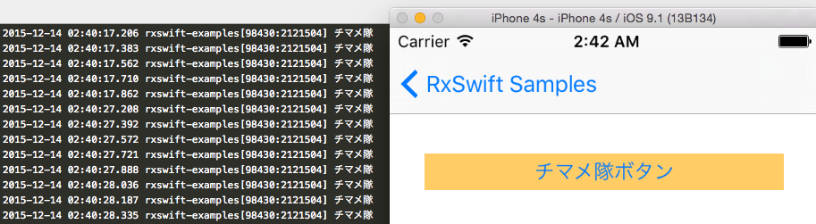
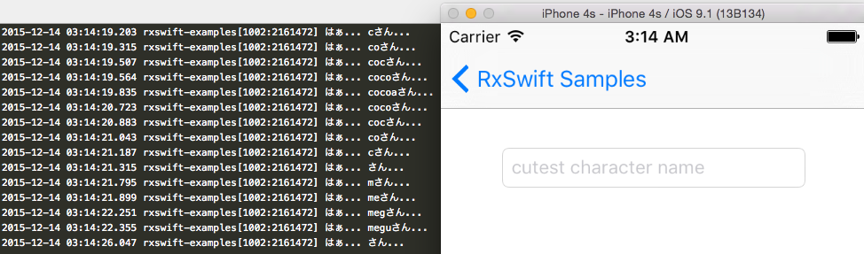
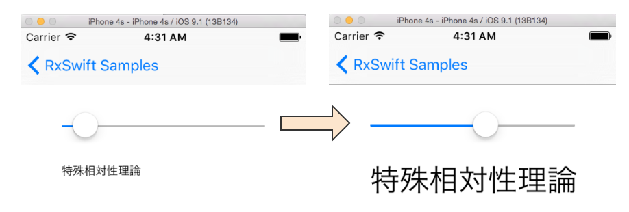

Title: ご注文はRxですか?
Subtitle: RxSwiftを用いたアプリ設計・開発の実践
Author: @gomi_ningen
Author(romaji): gomi_ningen


# ご注文はRxですか?

　ゴミ人間（@gomi_ningen）です。2014年春からラビットハウスで住み込みバイトを始めました。
同僚のリゼちゃんや可愛い妹のチノちゃんと楽しく働いています♪昨年まではJVMと戯れるお仕事をしていたのですが、最近は専らiOSアプリ開発に携わっています。

 さて、今回はネイティブアプリ開発で採用が増えている、Rx系ライブラリを利用した設計・開発の実践例をご紹介します。
本記事中では `RxSwift/RxCocoa 2.0.0-beta4` を用いて説明を行いますが、それぞれ各プラットフォームの対応するライブラリに読み替えていただければ幸いです。

## 第1羽 ココア先輩の優雅なRxチュートリアル

 RxSwiftを利用したアプリケーションの設計・開発の話に入る前に、そもそもどのようなライブラリなのか、ココア先輩と一緒に学んでいきましょう。
なお、もうすでにRx系のライブラリの利用に慣れている方は、第1羽を読み飛ばしても大丈夫です。

### ココア先輩と行うライブラリの導入

　RxSwift/RxCocoaの導入にはCocoaPodsが便利です。
CocoaPodsは Bundler を用いて、以下のように導入することができます。

```sh
# プロジェクトルートに移動後、以下を実行
$ echo 'gem '\''cocoapods'\'', '\''~> 0.39.0'\''' >> Gemfile
$ bundle install
$ pod init
```

　続いて `pod init` で生成された `Podfile` に以下の2行を追加し、`bundle exec pod install` すればライブラリの導入は完了です。

```
    pod 'RxSwift', '2.0.0-beta4'
    pod 'RxCocoa', '2.0.0-beta4'
```	

　なお、筆者の動作確認環境は Xcode 7.2 になります。

### Hello, world

　Rxについては色々な説明がありますが、今回はまず動くコードを見ていくことにします。
ド定番の Hello, world は `RxSwift` を import した上で次のように書きます。

```swift
["hello, world"].asObservable()
    .subscribeNext({ (str) -> Void in NSLog(str) })
```

　これを実行すると無事 "Hello, world" が出力されると思います。 
また `asObservable()` の前の配列に要素を追加すると、各要素が `NSLog` されると思うので試してみてください。
どうやら配列の要素が次々と `subscribeNext` の引数 `str` に渡され、実行されているようです。

### UIButton のイベントを拾う

　Hello, worldの例では、このライブラリを使う利点が見いだせそうにありません。
そこで、ネイティブアプリにありがちなUIイベントの処理に利用する例を見てみることにします。
とりあえず、細かな話は抜きにして、適当なビューに UIButton を作成して ViewController の viewWillAppear に次のようなコードを記述してください。

```swift
import UIKit
import RxSwift

class ViewController: UIViewController {

    private var disposeBag = DisposeBag
    @IBOutlet weak var button: UIButton!

    override func viewWillAppear(animeted: Bool) {
        super.viewWillAppear(animated)
        button.rx_tap
            .subscribeNext { NSLog("チマメ隊") }
            .addDisposableTo(disposeBag)
    }

    override func viewWillDisappear(animated: Bool) {
        super.viewWillDisappear(animated)
        disposeBag = DisposeBag()
    }
}
```

　これを実行して、ボタンをタップすると 「チマメ隊」というログ出力がされるはずです。
ボタンのタップイベントの処理方法は多々ありますが、Rxを使ったパターンはわりあい見通しの良いものになっているかと思います。




### UITextFiledのイベントを拾う 

　続いてテキストフィールドの文字入力イベントを拾う例を考えてみましょう。
適当なビューに `UITextField` を作成して、 `viewWillAppear` に以下のようなコードを記述してみてください。

```swift
textField.rx_text
    .map { "はぁ... " + $0 + "さん..." }
    .subscribeNext { NSLog($0) }
    .addDisposableTo(disposeBag)
```

　すると以下のように、文字入力や削除のたびにイベントが発生して、`NSLog` でログが出力されるのがわかると思います。



　もしテキストフィールドに特定の値が来たときだけのイベントを拾いたい際は、例えば以下のように `filter` をしてあげれば良い感じになります。

```swift
textField.rx_text
    .filter { $0 == "ココア" }  //=> テキストフィールドに「ココア」と入力されたときだけ以後のステップに進む
    .map { "はぁ... " + $0 + "さん..." }
    .subscribeNext { NSLog($0) }
    .addDisposableTo(disposeBag)
```


### UISliderの値に応じてUILabelのフォントサイズを変更する

　さて、もっとインタラクティブな例を見てみましょう。スライダーの値に応じてラベルの文字サイズを変更するような処理を書きたいとします。このとき、以下のように `UISlider` の値の変更イベントを `UILabel` の `rx_attributedText` に `bind` してあげれば OK です。

```swift
slider.rx_value
    .map {
        NSAttributedString(
            string: "特殊相対性理論",
            attributes: [NSFontAttributeName: UIFont(name: "HiraginoSans-W3", size: CGFloat($0))!]
        )
    }
    .bindTo(label.rx_attributedText)
    .addDisposableTo(disposeBag)
```

　`UISlider` の上限値と下限値をうまい感じに設定すれば、以下のようにスライダーの値に応じてラベルのサイズが変化するような実装が簡単に行えます。



### RxSwift を使ってみよう

　以上の例を見ていただければ、だいたいのUIコンポーネントのイベントは `RxSwift(RxCocoa)` を使って処理できることが分かっていただけたのではないでしょうか。

　iOS開発でのUIイベント処理は、コールバックやデリゲートで対応していくパターンが多いと思いますが、RxSwiftを使うと宣言的に書くことができるようになっています。特に、コールバックを避けることによりイベント処理を各Viewのクラスに散らさずにすむことにより、コードの見通しが格段に向上するのではないかと考えています。

　また、`map`, `filter` をはじめてとして様々な高階関数を利用できる点も優れています。これらをチェインでつなぐことにより、イベントデータの変形や抽出などが自由自在にできます。

　以上の内容は「Reactive Programmingとは何か」などということは知っていなくても、理解できたのではないでしょうか？ `RxSwift`を使おうか迷っている方は、巷に出回っている難しい記事をみて頭をひねるより、まず使ってみることをお勧めします。

　ここでご紹介した `RxSwift` の利用例は、[GitHub](https://github.com/53ningen/rxswift-examples) にて公開していますので是非 `clone` して動かしてみてください。Xcode7.2 で動作を確認しています。

```sh
$ git clone git@github.com:53ningen/rxswift-examples.git 
$ cd ./rxswift-examples
$ bundle install 
$ bundle exec pod install
$ open ./rxswift-examples.xcoworkspace
```

## 第2羽 通信をするお話

## 第3羽 Call Me from UI Thread.

## 第4羽 対非同期処理用決戦部隊、通称チマメ隊

## 第5羽 君のためなら開発する