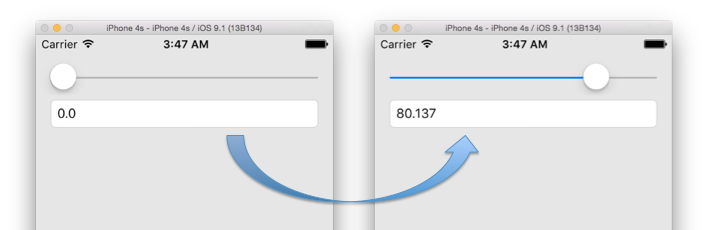

Title: ご注文はRxですか?
Subtitle: RxSwiftを用いたアプリ設計・開発の実践
Author: @gomi_ningen
Author(romaji): gomi_ningen


# ご注文はRxですか?

ゴミ人間（@gomi_ningen）です。2014年春からラビットハウスで住み込みバイトを始めました。
同僚のリゼちゃんや可愛い妹のチノちゃんと楽しく働いています♪

昨年まではJVMと戯れるお仕事をしていたのですが、最近は専らiOSアプリ開発に携わっています。
さて、今回はネイティブアプリ開発で採用が増えている、Rx系ライブラリを利用した設計・開発の実践例をご紹介します。
本記事中では `RxSwift/RxCocoa 2.0.0-beta2` を用いて説明を行いますが、それぞれ各プラットフォームの対応するライブラリに読み替えていただければ幸いです。

## 第1羽 ココア先輩の優雅なRxチュートリアル

RxSwiftを利用したアプリケーションの設計・開発の話に入る前に、そもそもどのようなライブラリなのか、ココア先輩と一緒に学んでいきましょう。
なお、もうすでにRx系のライブラリの利用に慣れている方は、第1羽を読み飛ばしても大丈夫です。

### ココア先輩と行うライブラリの導入

RxSwift/RxCocoaの導入にはCocoaPodsが便利です。`Podfile` に以下の2行を追加し、`pod install` すればライブラリの導入は完了です。

```
    pod 'RxSwift', '2.0.0-beta2'
    pod 'RxCocoa', '2.0.0-beta2'
```	

なお、筆者の動作確認環境は Xcode 7.1 beta 3 (7B85) になります。

### Hello, world

Rxについては色々な説明がありますが、今回はまず動くコードを見ていくことにします。
ド定番の Hello, world は `RxSwift` を import した上で次のように書きます。

```swift
["hello, world"].asObservable()
    .subscribeNext({ (str) -> Void in NSLog(str) })
```

これを実行すると無事 "Hello, world" が出力されると思います。 
また `asObservable()` の前の配列に要素を追加すると、各要素が `NSLog` されると思うので試してみてください。
どうやら配列の要素が次々と `subscribeNext` の引数 `str` に渡され、実行されているようです。

### UIButton のイベントを拾う

Hello, worldの例では、このライブラリを使う利点が見いだせそうにありません。
そこで、ネイティブアプリにありがちなUIイベントの処理に利用する例を見てみることにします。
これまた定番ですが、ボタンを押したらログを出力するというケースについて考えます。
適当なビューに `UIButton` を作成して ViewController の `viewWillAppear` に次のようなコードを記述してください。
このとき `RxCocoa` の import が必要です。

```swift
button.rx_tap
    .subscribeNext { NSLog("はぁ... ココアさん...") }
    .addDisposableTo(disposeBag)
```

これを実行して、ボタンをタップすると "はぁ... ココアさん..." とログ出力されるはずです。
ボタンのタップイベントの処理方法は多々ありますが、Rxを使ったパターンはわりあい見通しの良いものになっているかと思います。

### UITextField のイベントを拾う

お次はテキストフィールドの文字入力イベントを拾う例を考えてみましょう。
適当なビューに `UITextField` を作成して、 `viewWillAppear` に以下のようなコードを記述してみてください。

```swift
textField.rx_text
    .filter { (str) -> Bool in str.characters.count >= 3 }
    .subscribeNext { (str) -> Void in NSLog(str) }
    .addDisposableTo(disposeBag)
```

これを実行して、テキストフィールドに文字を入力していきましょう。
例えば「a, b, c, d, e」と順番に入力していくと、3文字以上を入力したときからテキストフィールドの中身がログ出力されるようになるかと思います。
また文字列を削除していくと、2文字以下のときにはログ出力がされなくなるかと思います。

コードを確認してみると `filter` にそれらしき条件式が書かれています。
どうやらテキストフィールドの中身が更新されるたびにイベントが発行され、`filter` の条件に合致した文字列が `subscribeNext` のクロージャに渡され実行されているようです。
これは通常のイベント処理と比べて、かなり便利になっていると言えるのではないでしょうか。

### UISliderの値をUITextFieldに反映させる

RxSwift/RxCocoa を使うと `UISlider` の変化を拾って `UITextField` に反映させるというようなことも、簡単で見通しの良いコードになります。
適当なビューに `UISlider` と `UITextField` を作成して、以下のようなコードを実行してみてください。

```swift
slider.rx_value
    .map { String($0) }
    .bindTo(textField1.rx_text)
    .addDisposableTo(disposeBag)
```

`slider` をスライドさせると、それに応じて UITextField の値が変化していくのがわかると思います。
`UISlider` の値は `Int` なので、 `String` に型変換してから `textField` にバインドしている点に注意です。



### RxSwift を使ってみよう

RxSwiftは「リアクティブプログラミング」を実現するライブラリといわれています。
この「リアクティブプログラミング」とは何かということについては色々な説明がなされていて、多くの人は記事の内容がよくわからずRx関連のライブラリを使うことをためらうかと思います。	

しかし、これまで見てきたように RxSwift は、リアクティブプログラミングについて理解していなくても十分に使いこなせるものです。
本記事では、 RxSwift/RxCocoa の iOSアプリ開発での実践事例を紹介していきますので、難しいことは考えずにまずは気軽に試していきましょう。

続く第2羽「通信をするお話」では、ほとんどのネイティブアプリで必要になる通信処理の部分で RxSwift の利用例を。
第3羽「Call Me from UI Thread.」では、通信結果をビューに反映させるときの実例や、カスタムビューのイベントを拾うパターンについて。
第4羽「対非同期処理用決戦部隊、通称チマメ隊」では、非同期処理やスレッドまわりの細かい処理について見ていきます。


## 第2羽 通信をするお話

## 第3羽 Call Me from UI Thread.

## 第4羽 対非同期処理用決戦部隊、通称チマメ隊

## 第5羽 君のためなら開発する