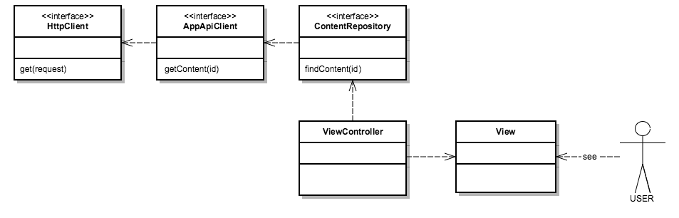
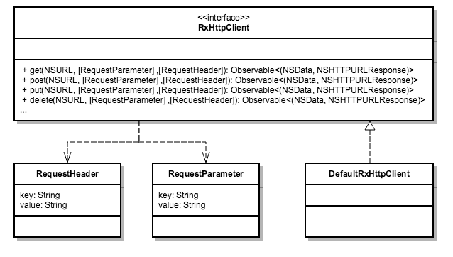
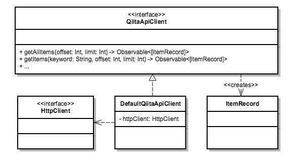

Title: ご注文はRxですか?
Subtitle: RxSwiftを用いたアプリ設計・開発の実践
Author: @gomi_ningen
Author(romaji): gomi_ningen


# ご注文はRxですか?

　ゴミ人間（@gomi_ningen）です。2014年春からラビットハウスで住み込みバイトを始めました。
同僚のリゼちゃんや可愛い妹のチノちゃんと楽しく働いています♪昨年まではJVMと戯れるお仕事をしていたのですが、最近は専らiOSアプリ開発に携わっています。

 さて、今回はネイティブアプリ開発で採用が増えている、Rx系ライブラリを利用した設計・開発の実践例をご紹介します。
本記事中では `RxSwift/RxCocoa 2.0.0-beta4` を用いて説明を行いますが、それぞれ各プラットフォームの対応するライブラリに読み替えていただければ幸いです。

## 第1羽 ココア先輩の優雅なRxチュートリアル

 RxSwiftを利用したアプリケーションの設計・開発の話に入る前に、そもそもどのようなライブラリなのか、ココア先輩と一緒に学んでいきましょう。
なお、もうすでにRx系のライブラリの利用に慣れている方は、第1羽を読み飛ばしても大丈夫です。

### ココア先輩と行うライブラリの導入

　RxSwift/RxCocoaの導入にはCocoaPodsが便利です。
CocoaPodsは Bundler を用いて、以下のように導入することができます。

```sh
# プロジェクトルートに移動後、以下を実行
$ echo 'gem '\''cocoapods'\'', '\''~> 0.39.0'\''' >> Gemfile
$ bundle install
$ pod init
```

　続いて `pod init` で生成された `Podfile` に以下の2行を追加し、`bundle exec pod install` すればライブラリの導入は完了です。

```
    pod 'RxSwift', '2.0.0-beta4'
    pod 'RxCocoa', '2.0.0-beta4'
``` 

　なお、筆者の動作確認環境は Xcode 7.2 になります。

### Hello, world

　Rxについては色々な説明がありますが、今回はまず動くコードを見ていくことにします。
ド定番の Hello, world は `RxSwift` を import した上で次のように書きます。

```swift
["hello, world"].asObservable()
    .subscribeNext({ (str) -> Void in NSLog(str) })
```

　これを実行すると無事 "Hello, world" が出力されると思います。 
また `asObservable()` の前の配列に要素を追加すると、各要素が `NSLog` されると思うので試してみてください。
どうやら配列の要素が次々と `subscribeNext` の引数 `str` に渡され、実行されているようです。

### UIButton のイベントを拾う

　Hello, worldの例では、このライブラリを使う利点が見いだせそうにありません。
そこで、ネイティブアプリにありがちなUIイベントの処理に利用する例を見てみることにします。
とりあえず、細かな話は抜きにして、適当なビューに UIButton を作成して ViewController の viewWillAppear に次のようなコードを記述してください。

```swift
import UIKit
import RxSwift

class ViewController: UIViewController {

    private var disposeBag = DisposeBag
    @IBOutlet weak var button: UIButton!

    override func viewWillAppear(animeted: Bool) {
        super.viewWillAppear(animated)
        button.rx_tap
            .subscribeNext { NSLog("チマメ隊") }
            .addDisposableTo(disposeBag)
    }

    override func viewWillDisappear(animated: Bool) {
        super.viewWillDisappear(animated)
        disposeBag = DisposeBag()
    }
}
```

　これを実行して、ボタンをタップすると 「チマメ隊」というログ出力がされるはずです。
ボタンのタップイベントの処理方法は多々ありますが、Rxを使ったパターンはわりあい見通しの良いものになっているかと思います。


### UITextFiledのイベントを拾う 

　続いてテキストフィールドの文字入力イベントを拾う例を考えてみましょう。
適当なビューに `UITextField` を作成して、 `viewWillAppear` に以下のようなコードを記述してみてください。

```swift
textField.rx_text
    .map { "はぁ... " + $0 + "さん..." }
    .subscribeNext { NSLog($0) }
    .addDisposableTo(disposeBag)
```

　すると以下のように、文字入力や削除のたびにイベントが発生して、`NSLog` でログが出力されるのがわかると思います。


　もしテキストフィールドに特定の値が来たときだけのイベントを拾いたい際は、例えば以下のように `filter` をしてあげれば良い感じになります。

```swift
textField.rx_text
    .filter { $0 == "ココア" }  //=> テキストフィールドに「ココア」と入力されたときだけ以後のステップに進む
    .map { "はぁ... " + $0 + "さん..." }
    .subscribeNext { NSLog($0) }
    .addDisposableTo(disposeBag)
```


### UISliderの値に応じてUILabelのフォントサイズを変更する

　さて、もっとインタラクティブな例を見てみましょう。スライダーの値に応じてラベルの文字サイズを変更するような処理を書きたいとします。このとき、以下のように `UISlider` の値の変更イベントを `UILabel` の `rx_attributedText` に `bind` してあげれば OK です。

```swift
slider.rx_value
    .map {
        NSAttributedString(
            string: "特殊相対性理論",
            attributes: [NSFontAttributeName: UIFont(name: "HiraginoSans-W3", size: CGFloat($0))!]
        )
    }
    .bindTo(label.rx_attributedText)
    .addDisposableTo(disposeBag)
```

　`UISlider` の上限値と下限値をうまい感じに設定すれば、以下のようにスライダーの値に応じてラベルのサイズが変化するような実装が簡単に行えます。


### RxSwift を使ってみよう

　以上の例を見ていただければ、だいたいのUIコンポーネントのイベントは `RxSwift(RxCocoa)` を使って処理できることが分かっていただけたのではないでしょうか。

　iOS開発でのUIイベント処理は、コールバックやデリゲートで対応していくパターンが多いと思いますが、RxSwiftを使うと宣言的に書くことができるようになっています。特に、コールバックを避けることによりイベント処理を各Viewのクラスに散らさずにすむことにより、コードの見通しが格段に向上するのではないかと考えています。

　また、`map`, `filter` をはじめてとして様々な高階関数を利用できる点も優れています。これらをチェインでつなぐことにより、イベントデータの変形や抽出などが自由自在にできます。

　以上の内容は「Reactive Programmingとは何か」などということは知っていなくても、理解できたのではないでしょうか？ `RxSwift`を使おうか迷っている方は、巷に出回っている難しい記事をみて頭をひねるより、まず使ってみることをお勧めします。

　ここでご紹介した `RxSwift` の利用例は、[GitHub](https://github.com/53ningen/rxswift-examples) にて公開していますので是非 `clone` して動かしてみてください。Xcode7.2 で動作を確認しています。

```sh
$ git clone git@github.com:53ningen/rxswift-examples.git 
$ cd ./rxswift-examples
$ bundle install 
$ bundle exec pod install
$ open ./rxswift-examples.xcoworkspace
```

## 第2羽 通信をするお話

　第1羽でみてきたように `RxSwift` を利用すると、UIイベントを手軽にハンドリングすることができます。
アプリ開発で行う定番の処理としてもう一つ押さえておかなければならないのは、通信処理かと思います。
実はこれも `RxSwift` を用いて良い感じに扱うことができます。

　利用方法も非常に簡単なのでまずはコード例をみてみましょう。`NSURLSession` のインスタンスに `rx_response` というプロパティが生えているので、これを使えば以下のように簡単に通信処理が行えます。

```swift
import RxSwift
import UIKit

class SimpleNetworkingSampleViewController: UIViewController {

    private var disposeBag: DisposeBag = DisposeBag()
    private let backgroundWorkScheduler = ConcurrentDispatchQueueScheduler(globalConcurrentQueuePriority: .High)
    
    override func viewWillAppear(animated: Bool) {
        super.viewWillAppear(animated)
        let url = NSURL(string: "http://gochiusa.com")!
        let request = NSURLRequest(URL: url)
        NSURLSession.sharedSession().rx_response(request)
            .subscribeOn(backgroundWorkScheduler)
            .observeOn(MainScheduler.sharedInstance)
            .subscribeNext { (data, response) -> Void in
                if let str = String(data: data, encoding: NSUTF8StringEncoding) {
                    print(str)
                }
            }
            .addDisposableTo(disposeBag)
    }
    
    override func viewWillDisappear(animated: Bool) {
        super.viewWillDisappear(animated)
        disposeBag = DisposeBag()
    }

}
```

　`subscribeNext` で渡しているクロージャの中身を見れば大体察しがつくかと思いますが、`rx_response` は `(NSData, NSHTTPURLResponse)` を返してくれるものになってます。


### RxSwiftを用いた通信エラー処理

　さて、上記の例に加えてエラー処理をしたいケースを考えてみましょう。たとえば、存在しないページにアクセスした場合は、404のステータスコードとページが見つからない旨のレスポンスが返ってくると思います。

```swift
let url = NSURL(string: "http://gochiusa.com/hogehoge")!
let request = NSURLRequest(URL: url)
NSURLSession.sharedSession().rx_response(request)
    .subscribeOn(backgroundWorkScheduler)
    .observeOn(MainScheduler.sharedInstance)
    .subscribeNext { (data, response) -> Void in
        if let str = String(data: data, encoding: NSUTF8StringEncoding) {
            print("status code: " + String(response.statusCode))
            print("response body: " + str)
        }
    }
    .addDisposableTo(disposeBag)

// => ログ出力
// status code: 404
// response body: <!DOCTYPE HTML PUBLIC "-//IETF//DTD HTML 2.0//EN">
// <html><head>
// <title>404 Not Found</title>
// </head><body>
// <h1>Not Found</h1>
// <p>The requested URL /hoge was not found on this server.</p>
// </body></html>
```

　Rxにはエラー的な状況をハンドリングする仕組みがあります。例えば、ステータスコードが 200 のときには、レスポンスを `String` で、それ以外のときには `NSError` を流すには次のように書けば OK です。

```swift
NSURLSession.sharedSession().rx_response(request)
    .flatMap({ (data, response) -> Observable<String> in
        if let string = String(data: data, encoding: NSUTF8StringEncoding) where response.statusCode == 200 {
            // 成功値を流すには flatMap の中で just(値) を返せばよい
            return just(string) 
        } else {
            // エラーを流すには flatMap の中で failWith(NSError) を返せばよい
            return failWith(NSError(domain: "ConnectionError", code: response.statusCode, userInfo: nil))
        }
    })
    .subscribeOn(backgroundWorkScheduler)
    .observeOn(MainScheduler.sharedInstance)
    .subscribe({ (event) -> Void in
        switch event {
        case .Next(let string): print(string)  // 値の処理
        case .Error(let e): self.showDialog(e) // エラー処理
        case .Completed: break
        }
    })
    .addDisposableTo(disposeBag)
```

　コードからわかるように、flatMapの中で `just(値)` を返すと成功値を流すことができます。
また `failWith(ErrorType)` を返すとエラーを伝播させることができます。

### 通信処理の階層化

　簡単なアプリであれば、上記の `NSURLSession.rx_response` を `ViewController` から直接呼び出してしまっても良いのですが、ちょっと複雑な画面やロジックが入るようなアプリを作る際にこれをやってしまうと、たちまちどこに何が書いてあるのかが分からなくなります。

　そこで、通信処理とそのレスポンスの加工を、以下の3つの要素に分離して実装を行うパターンが個人的には気に入っています。

1. HTTPリクエストを組みたて通信を行う責務を持つ `HttpClient`
2. 利用するウェブAPIに与えるパラメータとそのレスポンスを抽象化した `ApiClient`
3. ウェブAPIからのレスポンスやキャッシュなどからデータを取得し、クライアント側からコレクションのように操作を加えられるようにした `Repository`



　こうすることにより、例えばリクエストの組み立てなどの部分で、同じロジックを繰り返し書くことを防げます。またスタブを利用したテストを書けば、各処理部単位で正しい実装が行われていることを保証することもできます。また、アプリ開発においてはデザイン確認用のレスポンスを返すスタブを作ると便利かもしれません。

　次羽からは `HttpClient` と `ApiClient` の実装についてみていきます。

## 第3羽 Call Me HttpClient.

　HTTPリクエストを組み立てる機能単位を HttpClient にまとめることを考えます。
こうすることによりクエリパラメータのURLエンコード処理やリクエストヘッダーを作る部分の共通処理をまとめることができます。
また、`HttpClient` としてプロトコル（他言語でいうところのインターフェース）を切っておくことにより、
実際の通信時に用いるライブラリやSwiftのAPIへの依存を外側に晒さずにすむという効果もあります。
作るものの全体像は下図のようなものになります。



　`RequestParameter` と `RequestHeader` は、単純に Key-Value 的なただのデータ構造です。
実装的には以下のように typealias としてあげるのが一番簡単ですが、個別に `struct` を定義しても大丈夫です。
`RxHttpClient` のプロトコル自体もそのまま書き下せば良いかと思います。

```swift
import RxSwift
import Foundation

public typealias RequestParameter = (key: String, value: String)
public typealias RequestHeader = (key: String, value: String)

public protocol RxHttpClient {
        
    func get(url: NSURL, parameters: [RequestParameter], headers: [RequestHeader]) -> Observable<(NSData, NSHTTPURLResponse)>
    func post(url: NSURL, parameters: [RequestParameter], headers: [RequestHeader]) -> Observable<(NSData, NSHTTPURLResponse)>
    func put(url: NSURL, parameters: [RequestParameter], headers: [RequestHeader]) -> Observable<(NSData, NSHTTPURLResponse)>
    func delete(url: NSURL, parameters: [RequestParameter], headers: [RequestHeader]) -> Observable<(NSData, NSHTTPURLResponse)>
    
}
```

　ここで定義したプロトコルの実装クラスは、ちゃんと動けばどんな感じにしても良いかと思いますが、Alamofireなどライブラリに依存しない形で実装した一例を、[GitHub: https://github.com/53ningen/RxHttp](https://github.com/53ningen/RxHttp) に公開していますのでそちらをご覧いただければ幸いです。

　通信関連のエラー処理はこのあたりの層でハンドリングしてあげると以後の層の実装がすっきりすると思いますので、以前に紹介している `flatMap` 関数などを使い、よしなにエラー処理を記述すると使い勝手がなかなか良い `HttpClient` になるのではないでしょうか？


## 第4羽 APIを探す日常

　続いて、アプリで用いるウェブAPIの操作を抽象化した `ApiClient` について考えてみましょう。
使うエンドポイントに対して `Controller` で個別にリクエストパラメータやヘッダを指定するのは煩わしいですし、コード自体の見通しも悪くなります。
今回は例として、 [Qiita API: https://qiita.com/api/v2/docs](https://qiita.com/api/v2/docs) の記事リストを取得するAPI: `GET /api/v2/items` を扱ってみます。
実装する `ApiClient` の構造は以下の図のような形となります。



　`QiitaApiClient` の持つメソッドを見ると、指定すべきパラメータがはっきりと理解できるかと思います。
こうしてあげることによって、クライアントコードでAPIのデータを取得する際に迷わずパラメータを指定することができます。
図中に出てくる登場人物を確認しましょう。
まず、`HttpClient` は第3羽で作成したものと同じものとなります。
今回作成したい `ApiClient` は、メソッドの引数をいい感じに加工して `RequestParameter` や `RequestHeader` を生成し、 `HttpClient` に与えることにより、APIへの通信を行うという仕組みになっています。
`ItemRecord` は Qiita の投稿記事（item）レスポンスのデータ構造を定義したクラスです。
Qiita APIは、JSON形式でレスポンスを返してくれますが、`Controller` などでJSONをそのまま扱うのは見通しが悪いので、
こういったクラスを作成して、そのインスタンスにマッピングしてあげるのが良いかと思います。
プロトコルとデータ構造のコードはだいたい以下のようになります。

```swift
public protocol QiitaApiClient {
    
    func getItems(offset: Int, limit: Int) -> Observable<[ItemRecord]>
    func getItems(keyword: String, offset: Int, limit: Int) -> Observable<[ItemRecord]>
    
}

public struct ItemRecord {

    let id: String
    let title: String
    let url: String
    // 以下同様に...
    
}
```

　ここで定義したプロトコルの実装クラスでは、JSONを `ItemRecord` にマッピングするなど細かい作業が多くなってきます。RxSwiftを用いた ApiClient の作り方とはまた離れた話になってきますので、GitHub: https://github.com/53ningen/rxswift-examples/tree/master/rxswift-examples/Infrastructure に上げてあります。興味がある方は、そちらをご覧ください。


## 第5羽 君のためなら開発する

　RxSwift を用いたUIイベント処理と通信処理について簡単な解説を行ってきましたが、いかがでしたでしょうか。
Rx を利用することによりコールバックをほとんど使わずにイベント処理が行えたり、伝播させるデータの変形やフィルタが手軽に行えることがわかっていただけたのではないでしょうか。
また例外を使わずにエラー処理を行うことができる点も魅力的だと思います。今回の記事でご紹介した内容はRxの一側面にすぎませんので、ライブラリを使いながら様々なAPIを触って、活用法を考えていくと面白いのではないかと思います。

