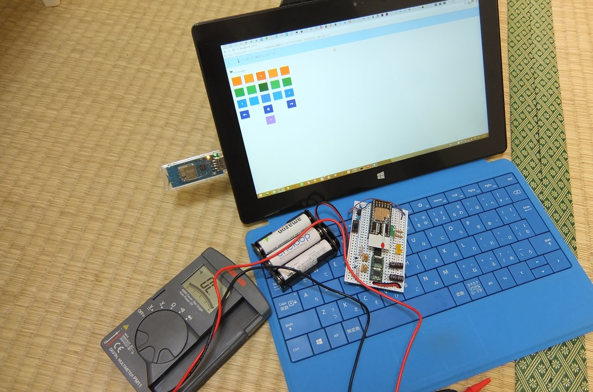
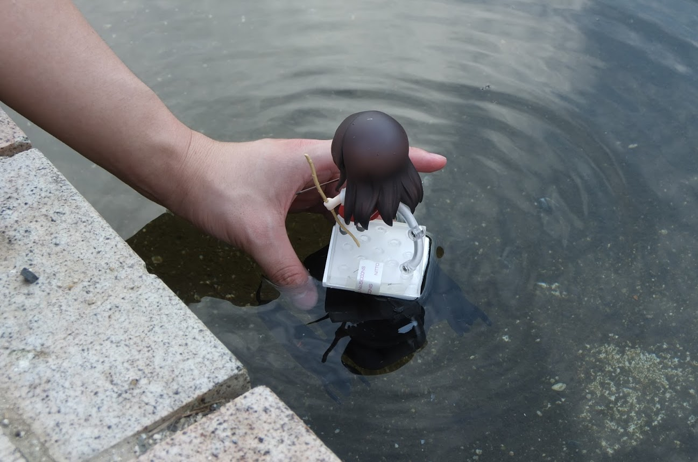
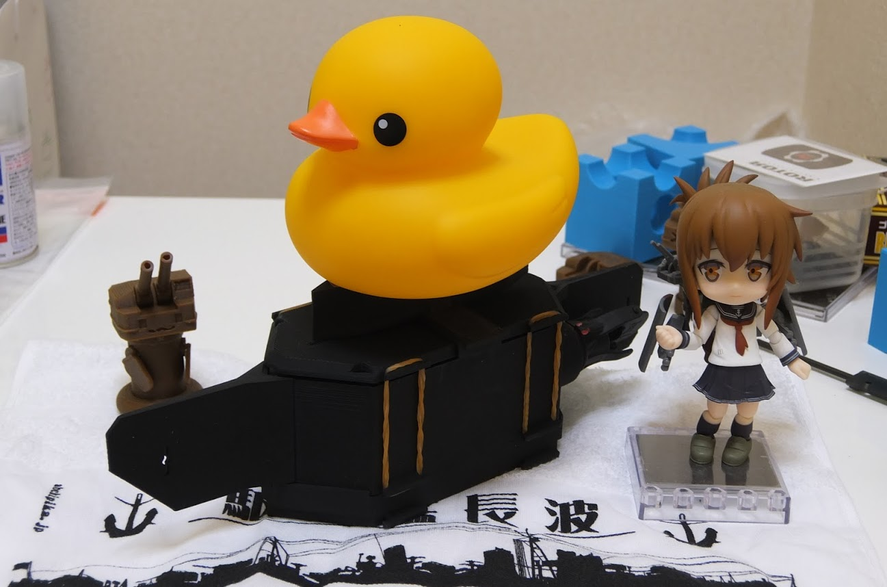
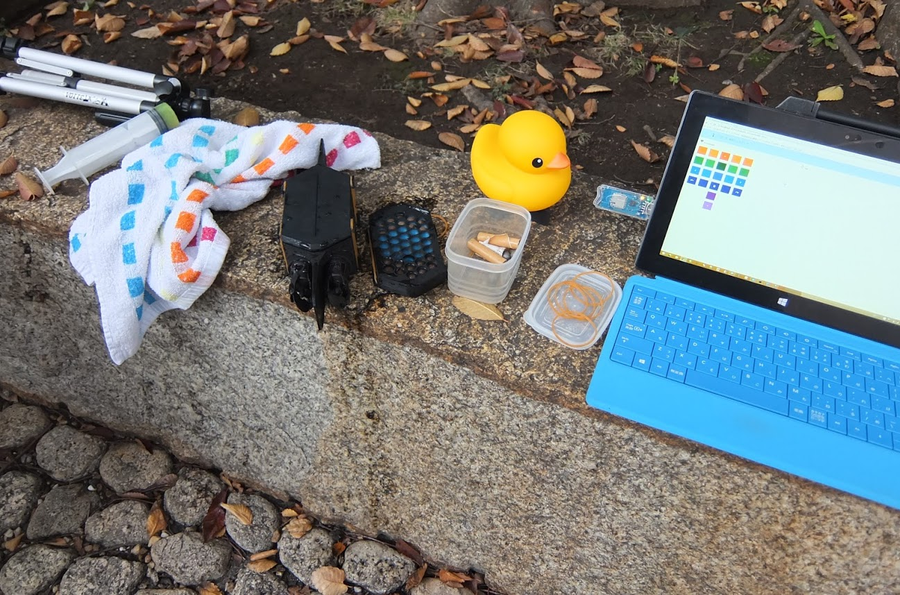
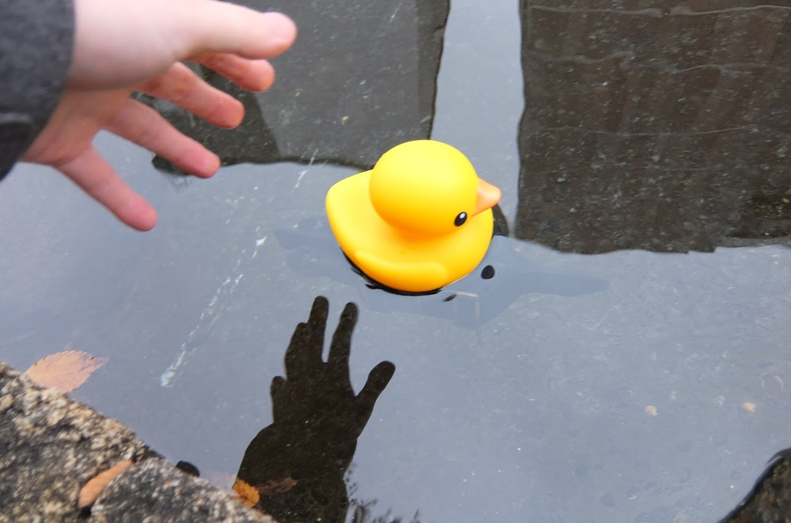
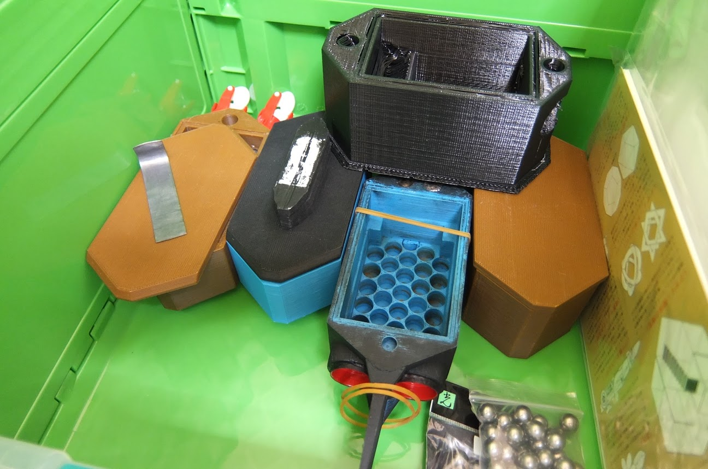
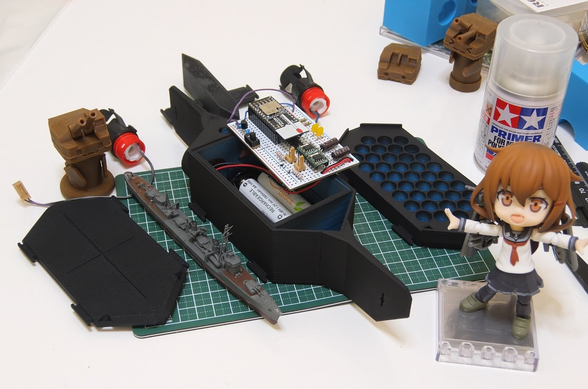

Title: TWE-liteで簡単無線通信
Subtitle: じたばた丸計画第二回中間報告
Author: @omegamega
Author(romaji): おめが

<!--
編集上、この上の行はこのまま残しておいてね
本番のファイルは index.md で作ってね
-->

# じたばた丸計画第二回中間報告

## 前回までのあらすじ

艦隊これくしょんとWorld of Warshipsを友人@greenspaとプレイしつつ「市販の1/700のフルハル軍艦模型を、ラジコン操作して遊びたい！できるなら将来的には自動運転もしたいし、やっぱりPC連携ね！」という欲で始まった「じたばた丸計画」。水面ギリギリに浮かぶラジコン半潜水艦「じたばた丸」を作り、その上に軍艦模型を乗せ浮力を調整すれば、水面の反射が潜水艦を隠してくれてかなりイイ感じに模型を泳がせることが可能であることまでは実証できました。ラジコン半潜水艦を作るコンセプトの正しさは証明できました。
ラジコン艦は、無線制御の中核にはTOCOS製TWE-lite無線マイコンモジュールを中核に、タミヤ製水中モーターを2軸を駆動させるのが基本構造としました。技術検証艦である1号艦では、とりあえずの食品保蔵用の100円タッパーに電池と回路一式を詰め込み、TOCOS提供のTWE-liteサンプルアプリにてコマンドを送信、ごくごく低速かつ船体制御は低いものの実際の動作に成功しました。また、近所の公園じゃぶじゃぶ池海域での試験航海も(流されながらも)無事達成することができました。次なる2号艦は船体を3Dプリントで生産し(プロトタイプを2回3Dプリントし、第3船体を実用として作成)、今後の量産に耐えうる仕様、モーター出力の向上、制御性能の向上をメイン目標として作りました。しかし、水密が難しいという潜水艦特有の問題が起きてしまい、そのまま原稿締め切りが来てしまった、というところで終わっていました。

今回はその続き、2号艦の船体/回路改良と、TWE-lite制御アプリを作った話になります。

# 2号艦・第3船体


前回の記事では、2号艦(電装系)と第3プリント船体は、水密試験がうまくい行かないところまでで終わっていました。
ざっくり変更点を書きますと、

* 1号艦
 * 非力な単三1本(アルカリ)の1.5Vモーター電源
 * DRV777モータードライバによる順方向のみ。単方向推進
* 2号艦
 * 強力な単三3本(エネループ)の3.6Vモーター電源
 * BD6211Fモータードライバによる順方向/逆方向制御。逆進可能

というのが大きな違いになります。共通の仕様としては、TWE-lite無線マイコンの電源はCR2032ボタン電池を使用していることぐらいで、ほぼ新規になっています。

もう一方の第3プリント船体は、モックの第1船体、パーツ擦り合わせ確認用の第2船体に続く、今回初めて作成した3Dプリンタ製の船体です。プリンタの最大出力寸法の都合であまり鋭角なシルエットではありませんが、真四角のタッパーよりは流水に対して抵抗の少ない形状と、水中モーターを違和感なく固定できる固定穴や、電池ボックスや回路をぴったり格納できる内部構造をもっています。主機となるタミヤ水中モーターは電池ボックス部を取り除き、モーター端子にケーブルをはんだ付けした上で、船体にホットボンドで固定しました。
2号艦電装は水中モーターとコネクタで電気的につないだ後、この第3船体内部に格納して、ゴムシートを張ったフタで閉じ、輪ゴムでぐるぐる巻きにして固定します。ゴムシートはAmazonで見つけましたが、一部のホームセンターでも取り扱いがあるようです。ゴムシートの密着面にはグリスを塗って、しっかり水密できるようにしました。したつもりでした。

うちで使っている3DプリンタはUp!Plus2で、このプリンタの最大出力寸法が12cm角程度なため、全長15cm近くある船体を吐くためには出力エリアに斜めに配置しなければなりません。これ以上の船体拡張も難しいため、より大きな出力範囲を持つプリンタが欲しくなりますが、オサイフ的には気軽に買えないのが難しいですね。より大型のものが必要になれば、パーツ分割をして個別出力後に接着となるでしょう。実際この後そうなりました。

## 水密検証による死亡


前回の記事でもかいたように、水を張った洗面台にて水密試験をしました。フタのグリスを追加したりしましたが結局ダメ。ホットボンドで固定した、モーター付近から水が入ってきてしまっているようでした。念のためタミヤ水中モーター自体の水密も確認(ちゃんとした船であればグリスを詰めたスタンションチューブでプロペラ軸を支えるが、水中モーターはCリングとグリスで水密していた)したが、結局問題なし。ということは、ホットボンドで固定した部分、船体と水中モーターの間が怪しそうです。
しかし、水揚げ後に1か月程度放置していたところ、どうやらモーターがさび付いてしまったようで、モーターがうんともすんとも動かなくなってしまいました。進水できないという残念な結果ですが、この船体は破棄するとし、モーターと船体の固定方法を考えなおすこととしました。
 
 ## 3Dプリント船体は浮力オーバー
 


これは予想外の問題でした。DFM式3Dプリントの場合、内部を中空に成形します。これが船の場合フロートとして有効なのですが、今回作るのはほぼ潜水艦。余計なフロートによって過剰な浮力が生まれてしまいました。
船体の後ろ三角がモーターを仕込む分重くなるのに対して、船首の前三角はほぼ空洞となり、激しく前後バランスを欠いてしまっていました。
鉄球をオモリとして仕込めるように作ってはありましたが、試してみると重さが全然足りません。念のため、鉄球と同サイズの鉛玉(やや鉄球より高かった)を注文しておき、いったん先へ進めることとしました。
 
# 第4船体
## 改良ポイント

水密に難があった第3船体のマイナーチェンジとして作成しました。水中モーターと船体の間が水密の問題となることから

* 水中モーターの本来のねじ込み構造を残す
* 水中モーターは船体から取り外し、乾燥や交換が可能なようにする

としました。具体的には、水中モーターの電池ボックス部を切断して、その部分を接着剤で船体に取り付け、モーターはそこにねじ込む仕様です。こうすることで、水中モーターが元々持つ水密ゴムパッキンやねじ込み部分を、じたばた丸の水密構造へ取り込みました。

また、船体下部を絞り込んだで浮力を減らしたり、船首の前三角にもオモリの鉄球/鉛玉を入れられるようにしました。


# pythonによる制御アプリjitabata_server

前回の動作試験ではTOCOS公式がTWE-lite検証用に提供していたWindowsアプリで制御してましたが、友人@greenspaがpythonアプリを作ってくれたため、WebからGUIによる操作ができるようになりました。
python製のhttpdアプリとウェブページに分かりており、ウェブページを適当な端末(そのまま立ち上がっているPC)で開き、各種ボタンを操作するとpython製のhttpdサーバのAPIを叩き、それがシリアル通信をしてTWE-liteの通信となる。といった仕組みです。APIとウェブページ(UI)を分けておくことで、後のカスタマイズがし易いだろうという目論見です。

これの開発に合わせて、回路側にLEDによるインジケータを付けました。動作しているかどうかわからなかったので、これは便利です。最初からやっておけばよかったですね。
また、ボタン電池CR2032でTWE-liteを直接動作させることは公式では非推奨だったことに気づいたことと、ボタン電池を仕込むスペースが惜しかったために、電源を共通化しました。モーター系用の3.6V電源からレギュレータICを通して、3Vを得てTWE-liteに供給するようにしました。


## 公園じゃぶじゃぶ池海域での試験航海

いつもの公園の池にて。
10月ともなると日が落ちるのが早く、土日は昼まで寝るような僕らには結構厳しくなってきました。水も冷たく、船を回収しに気軽に池に入るのも躊躇われる季節です。やはり水遊びは春から夏にかけての遊びでだなあとしみじみ。

# 試験航海からの反省

## 水密に問題はなし

水中モーターを接着、ねじ込み式にしたのは正解でこの部位からの浸水はありませんでした。
フタ部に関しても、グリスをたっぷり塗りこめば大丈夫な様子。3Dプリント船体はかなり有用なようです。

## 直進性がない

モーター出力を両舷とも同じにして直進にしても、半径1mぐらいで旋回してしまいます。旋回性は高いというよりは、その場でぐるぐる超信地旋回してしまうレベル。
まっすぐ進めない方が遥かに問題でした。

おかげで通りすがりのちびっこに、「誰かのサンダルが流されているよ」という的確なアドバイスをもらうことができました。実際は制御しようと四苦八苦していただけなんですがね…

## 推力がオーバーパワー

そのまま、TWE-liteの1024段階出力のうち、半分の512ですら早すぎる感じでした。また高すぎる出力は次の問題も起こしてしまいました。

## 推力が高すぎるとき、船体が沈んでしまう

じたばた丸は安定性を重視して鉄球のウエイトを船体下に配置したため、重心が推力中心より下になっています。ここに高すぎる出力が加わると、船体に前のめりの回転が働いてしまい、そのまま潜水してしまうことが分かりました。
さらに、TWE-liteは電波途絶したとき、最後の状態を保持しつづける仕様があります(標準アプリの場合)。潜水すると水の高い電波遮蔽によって必ず電波が途絶してしまうのですが、最後の状態を保持するので潜水したまま暴走し、池の底を走り続けてしまうのです。

## ウエイト調整が面倒

鉄球ウエイトを回路や電池と同じ空間に配置してしまったことによる問題です。回路と電池の下に鉄球が入っているため、浮力を調整するためには

* フタを固定している輪ゴムを外して、船体のフタをあける
* 回路と電池を取り出す
* 鉄球を入れる/減らす
* 回路と電池を戻す
* フタを戻して輪ゴムで固定する。必要に応じてフタにグリスを塗り直す

という手間がありました。水密区画を開け閉めするのは非常に面倒な作業な上、浸水の原因になってしまいます。水密区画である回路側は電源を入れたらそのままフタをしてしまい、遊び終わるまでフタを開けずに済むのが理想です。

# 第4号船体改良
## 直進性の改善、L/B比の話

まず一番謎だった問題から調べました、直進性です。
おそらくこの辺は船体の形状だろうということは検討付いていました。というのも、2軸推進で推力を調整して進む船というのは一般的な船ではありませんが、それほどタグボートなどでは採用例があり変ではありません。一方でじたばた丸の第4船体のような、前後が非常に短い船は現実にはあまり見かけません。まずはここから試べてみました。
ググっていると、戦後50年ぐらいの船体の歴史を語っているpdf資料(http://www.jasnaoe.or.jp/zousen-siryoukan/2010/100827-hanawa/100827-hanawa.pdf)を見つけることができました。ざっくりいうと、船体の設計は船体の水線長(長さ)と幅の比率L/B比というのがあり、L/B比が高く細い船体であるほど直進性に優れて水の抵抗が少なく、L/B比が小さく太い船体ほど旋回性能に優れて抵抗が大きい、というものでした。その資料ではさらに、船首の造波から生まれる波に乗るような低抵抗の船底構造や、そのシミュレート、造船技術の進歩による近代の船の省エネっぷり(具体例では100年前の豪華客船タイタニックと、近代の船を比較すると近代の船は、船底形状のみで抵抗が30%も削減されていて機関出力も相応に下がっている、など)が語られるなど、非常に興味深い資料でした。
ここではとりあえずじたばた丸L/B比にだけ注目してみます。先のpdfによると、古くの貨客船ではスピードが重視されL/B比が8～7の細い船体が主流だったり、逆に戦艦大和などはL/B比6.4と太め、現代のコンテナ貨物船では7.0～6.4、バラ積み貨物船では6.3～5.3程度だそうです。一方で約全長13cm幅6cmのじたばた丸第4船体のL/B比は約2.1、これはさすがに小さい。ということで前後に水中翼を付けて、船体を長くしてL/B比を改善します。
調べてみると、ラジコンボートや小型ヨットでも船体バランス調整に翼を付けることがあるようです。どうやら自分たちが気づくのが遅かっただけで、この辺の技術は一般的なようですね…。前後それぞれに6cm程度の翼を付けることで、約全長25cm、L/Bは4.1になりました。潜舵らしきものをほんのり付けてみると、これはこれで鋭利な潜水艦然としてスタイルになってきましたね

# 2号電装改良・推力調整

高すぎる推力については、モーターに制限抵抗を噛ますことで対処しました。
直流モーターの制御については、単純に見えてちゃんと制御しようとするなら結構大変な技術のようです。いろいろ調べてみてはいると、正しく制御するならチョッパ制御なりでモーターに流れ込む電流量を監視するのが正しいようです。が、PWMで初めてしまった都合と構造の単純さから、制限抵抗を仕込んで抵抗制御としました。エネルギー損失はありますが、手っ取り早く出力を下げられます。
今回はBD6211Fモータードライバーとタミヤ水中モーターの間に、1Ω抵抗を挟みました。その結果、全体的に出力が下がったのに加え、PWMのデューティー比が低い状態(低出力時)により低速で回すことができるようになりました。優雅に船を動かしたかった僕らにはバッチリです。
まあもともと制限抵抗なしというのが回路的によろしくなかったようですが…。どっかのタイミングで、ちゃんと勉強した方が良さそうですねえ。


# 改良船体での試験航海


いつものの池。池を走らせてみると、ずいぶんと操作しやすくなりました。
直進時にゆるやかに旋回する特性はある程度は残りましたが、そのときの旋回は10m以上ありそうな感じで実用に問題ない程度になりました。それでいて旋回は半径十数cm程度となかなかバッチリな挙動です。
高速直進時に旋回を行うとやや旋回が出遅れる感じがありますが、元々船舶は舵を聞き始めてから旋回するまで時間があるのが普通のようですし、反応の鈍さは2軸推進のバランスで旋回している基本設計によるところも多少あるかなと思われます。一方、方軸を逆進させての超信地旋回も可能ですし、これはこれでなかなか良いようでした。
半潜水艦としての性能は十分。とはいえ、浮力調整のウエイトの出し入れが面倒なことは変わりありません。次はこの辺の使い勝手を改善していきます


# 第5号船体

今回は改良ではなく、新規船体を作ります。第4船体改からの修正点は以下の通りになりました。


## ウエイトトレイ、モジュラリティ

オモリによる浮力調整をしやすくするために、水密区画からオモリを外しました。かわりに、鉄/鉛玉を仕込んたウエイトトレイを船体の底に、後付できる形式にしました。
これによって浮力の調整が格段にし易くなるはずです。頻繁に水密区画を開ける必要もなくなります。

他、軍艦模型を固定をしている柱も、今まではフタに直接取り付けていましたが、これもウエイトトレイ同様に別パーツとして後付できる仕様としました。

## 前三角を注水する構造にして、浮力を削減。前後バランスを解消

第3船体で船首の前三角の浮力が大きいことが問題でした。オモリで浮力を相殺するのも大変ですし、モーターが入っている後ろ三角と合わせて前後バランスも崩れていました。第4船体ではウエイトを仕込む方向で対処していましたが、あまりスマートではありませんでした。
そこで、第4船体では前三角をそもそも注水してしまう方向としました。中をくり抜いた形で成形し、船底と天井(フタ)に十分な穴をあけて、空気が抜けやすく水が入りやすくしました。


# nodejsによる制御アプリjitabata_serverjs

友人が作ってくれたpythonアプリにはTWE-lite子機から来るステータスを受け取る機能がありませんでした。せっかくなので、今後の機能追加も考え、自前でnodejsを使ってTWE-lite制御アプリを書いてみました。
TWE-liteのPC側デバイス「ToCoStick」はPC側からUSB接続のシリアルポートデバイスとして見えます。ということで、`nodejs`からシリアルポートを操作するために、`serialport`モジュールを使いましょう。npmで`serialport`モジュールをインストールします

serialportでのシリアルポートを開いて、書き込むにはこんな感じ。
```nodejs
var portName = 'COM3';		// Windowsでの一例。デバイス一覧゜
var serialport = require('serialport');
var sp = new serialport.SerialPort(portName, {
    baudRate: 115200,
    dataBits: 8,
    parity: 'none',
    stopBits: 1,
    flowControl: false,
    parser: serialport.parsers.readline("\n")
});

sp.write(":7880010F0F0380030002800200DF");
```

`write`しているのは実際のTWE-liteに送信するコマンド例です。コマンドはTOCOSのサイト内上級者向け資料で見つけることができます。[相手端末の出力を変更：0x80](http://mono-wireless.com/jp/products/TWE-Lite-DIP/TWE-Lite-DIP-step3-80.html)と[相手端末からの状態通知：0x81](http://mono-wireless.com/jp/products/TWE-Lite-DIP/TWE-Lite-DIP-step3-81.html)
TWE-lite子機から受け取る場合も`on('data',func)`というイベントで受け取ることができます。TWE-liteの初期設定では、1秒毎に通知されます。

```
sp.on('data', function(input) {
  var buffer = new Buffer(input, 'utf8');
  try {
    console.log("received:" + buffer);
  } catch(e) {
    console.log("error:"+e);
    return;
  }    
});
```

加えて、`express`モジュールにて、ウェブサーバーを立ち上げ、http経由のAPIを用意しておきます。こういったイベント事を並列で行う場合はマルチスレッドプログラミングが必要になるところですが、nodejsの場合意識せずに実装できたのが楽で良かったですね。

TWE-lite子機からのステータス通知は一旦サーバ側で保持するようにして、API経由でポーリングする方式としました。将来的には`socket.io`でリアルタイム化しようと考えています。操作UIはウェブページとして作成し、これらのAPIを叩くようにしました。具体的に完成したものはこちら(https://github.com/omegamega/jitabata_serverjs)になります。ステータス通知を受け取れるようになったため、新たに電源電圧と電波強度をラジコン操作中に知ることできるようになりました。




# あひる

さて、じたばた丸で水面に浮かべて遊んだら楽しいだろうアイテムを、軍艦模型以外にもないか探していたことがあります。アニメ版艦これでネタにもなった、赤城さんを水面滑走させる話はすでにあるのですが、如何せんトップヘビーになりがちで難しいことがすでに分かっています。



そこで他に何か面白いものがないか探していたところ、お風呂おもちゃのラバーダックが面白そうというところに行きあたりました。最近話題に上ったラバーダックプロジェクト(http://www.hetgallery.com/rubber-duck-project.html)というアートもあります。これをラジコン操作できたら面白いし、何より船よりユニークかなと思ったわけです。
調べてみるといくつかあひるの形状やカラーにバリエーションありました。一番かわいいあひるを探そうとすると、どうにもラバーダック・プロジェクトのものになるわけですが、残念ながらこのタイプのものは国内で一般販売してないようです。オリジナルはイギリスTOLO社で2000円程度のようですが、直接の購入手段がない以上ebayを通したりしてトータル6000円ぐらいしそうでした。一方で、ラバーダック・プロジェクトが大阪での展示をしたときに、限定販売したものがあるようです。今回はそれをオークションで手に入れました。



ぐうかわいい。

## じゃぶじゃぶ池海域での試験航海



というわけで今回はあひる装備での試験です。十分に浮力がある上部構造になったため、オモリは多めに積みました

# 試験航海からの知見

## ウエイトトレイは使いやすい

これについてはバッチリでした。オモリ調整がしやすくなって快適に遊べるようになりました。

## 輪ゴム固定で水密がゆるんでいる？



どうやら輪ゴムがゆるかったのか、フタ部の気密が甘かったのか、かなり浸水してしまいました。輪ゴム固定はもうちょっと検討の必要があるかもしれません。例えば、普通の輪ゴムの代わりにより太い輪ゴムを使う等。
また今回のことで気づいたのですが、電池や基板周辺が水に漬かると、電力がかかることで通常より早くサビが発生してしまうようです。これによって水がふれてしまった基板の一部も断線が起きてしまいました。幸い分かりやすい箇所でしたので、テスターで測りつつ直すことができましたが、そのうち対策が別途必要になるかもしれません。

## 制限抵抗による減速はばっちり。ちょっと効きすぎ

水中モーターに1Ωの制限抵抗を組み込んだことは良い結果になりました。非常に低速での航行ができるようになりました。
一方でトップスピードは下がりすぎた気があるので、間を取って0.5Ω程度に変更する予定です。

## あひるは公園ウケが良かった


黄色くて大きなあひるはかなり目立ちました。公園を通る人、特にちびっこの人気が高かったのは良かったですね。

## 電波途絶問題

今回初めてTWE-lite子機からのステータスを制御アプリから見れるようにしました。具体的には電源電圧と電波強度です。
電源電圧は問題なかったのですが、電波強度がかなり問題でした。1m程度離れたところですでに電波強度がぎりぎりで、3mも離れれば電波強度が足りず、姿勢(=アンテナ角度)次第で電波が途絶してしまうことが分かりました。以前の試験航海でも時々通信が切れていたような気がしましたが、今回電波強度が見れるようになったことで、電波強度問題がかなり重要度が高いことが明らかになりました。
今回の試験航海で使ったあひるの都合、船の水深が深くまた、あひると船体の間に水が入る空間があったため、それによって普段より電波強度が下がっていた可能性はあります。しかし、現状のじたばた丸が半潜水艦である以上、アンテナを水面に出す以外では抜本的な対策は難しそう。また、TWE-liteが使う電波が2.4GHzというこれまた水による減衰が大きい周波数帯であるのも、原因の一つですがこれを改善するのはTWE-liteを捨てる以外にほぼ不可能です。
まずは船の水深を浅くする、陸上にあるToCoStick(TWE-lite親機)側の通信状況を改善する、といった対策を次でやってみる予定です。

# 開発は続く

という感じで、順調ではあるものの開発スピードは落ちてしまっています。というのも、総火演があったり、艦これのイベントがあったり、World of Warshipsのイベントがあったり…、まあそんな感じです。
前回の時点で機能的には達成できただけに、船体の直進性やらソフト作りやら水密や電波問題やらと、周辺問題や解決すべきことが山盛りという感じでしょうか。別のアイデアもあります。ToCoStickを刺す親機PCを、Raspberry Pi(ラズベリーパイ)にすることを考えています。ToCoStick自体はLinuxでの動作もサポートしているため、ラズベリーパイに移行すればよりポータブルなラジコン環境が作れそうですね。



できることが増えた分、解決すべき問題や夢がひろがりんぐな状態になってきました。暖かくなる次の春夏までには一段の区切りをつけ、2,3隻のじたばた丸が量産できるといいなあ、と夢見ております。今回の開発報告はこの辺で。ではでは。

