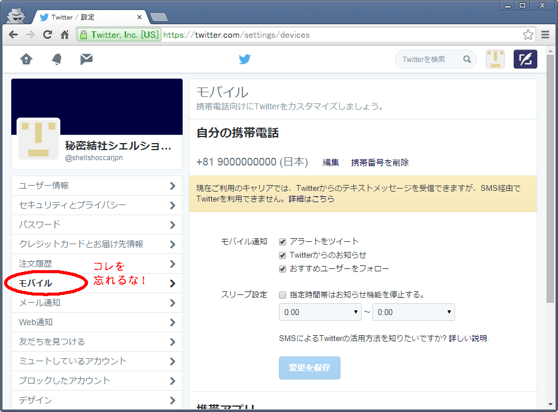
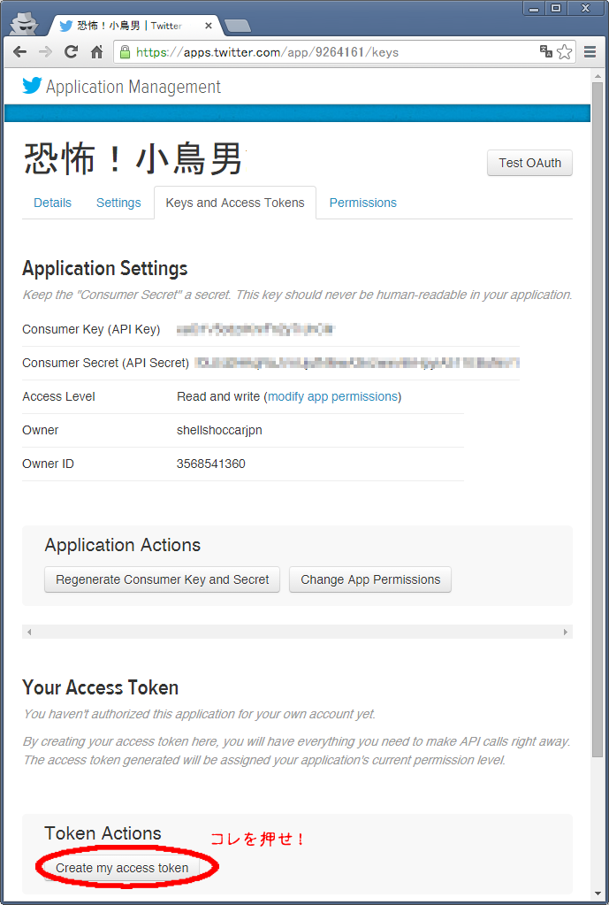
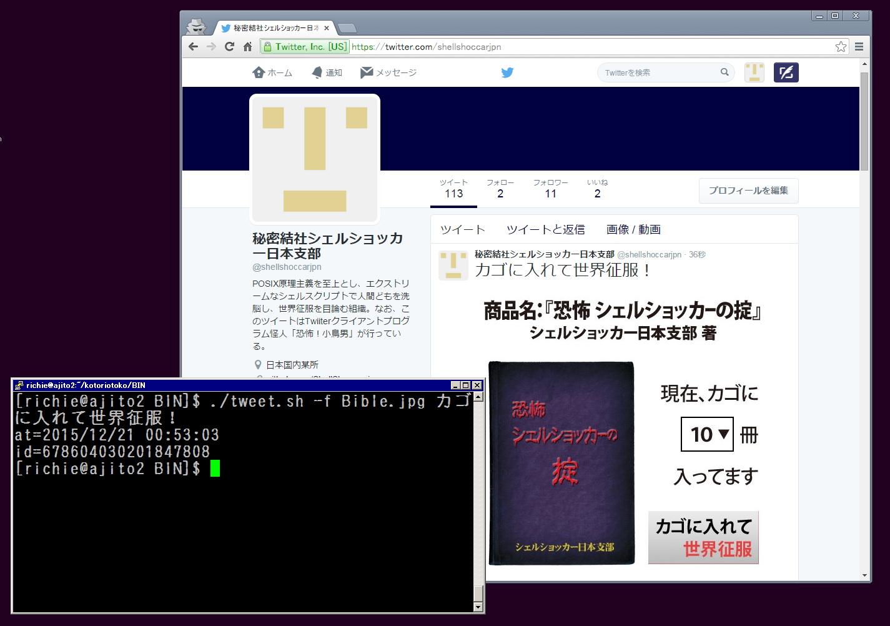
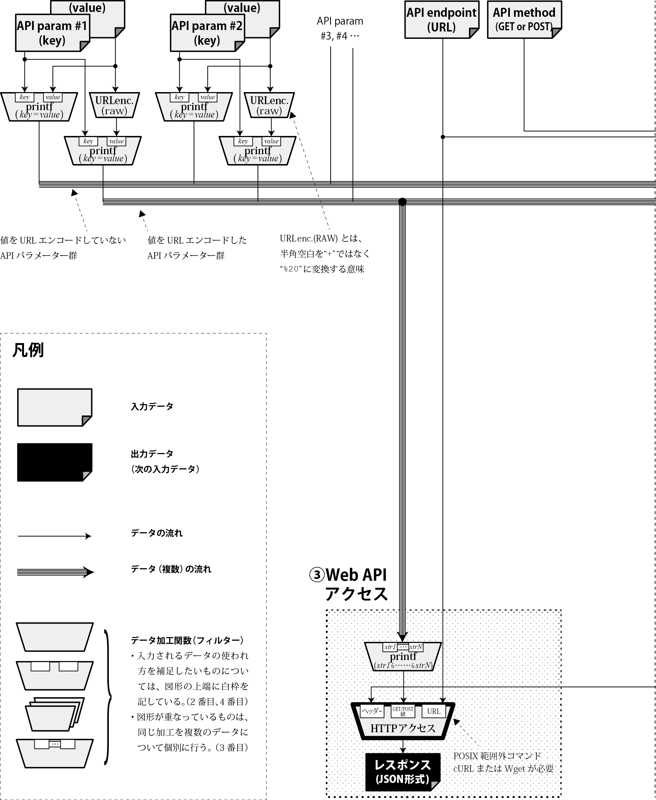
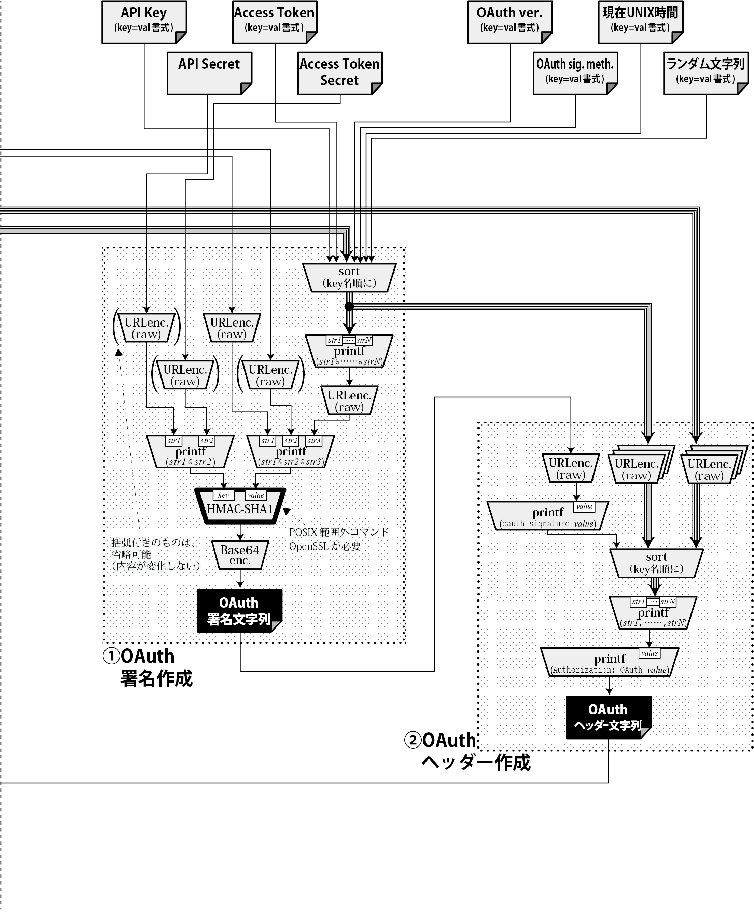

Title: 恐怖！火を吹くTwitter怪人「小鳥男」
Subtitle: アブナい自動ツイートでTwitter民達を炎上させろ
Author: @richmikan
Author(romaji): Rich Mikan


# 恐怖！小鳥男

説明しよう。この記事は、POSIX原理主義で世のプログラマーを洗脳し、世界征服を目論む「秘密結社シェルショッカー」の日本支部長、リッチー大佐が、今度はTwitter民を混乱させるべく、小鳥男というシェルスクリプト製Twitterクライアント怪人を造り出すという、それはそれはベリィ・テラブルな記事なのだ！

## 次のターゲットはTwitter上の一般人だ

　全世界70𥝱人(70𥝱人=70,000,000,000,000,000,000,000,000人)のプログラマーどもよ、ごきげんよう。私は偉大なる秘密結社シェルショッカーの日本支部長、リッチー大佐である。お前たち、我々が全国の書店やアマゾンに送り込んだ本の形をした怪人「すべてのUNIXで20年動くプログラムはどう書くべきか」男（ISBN:978-4-86354-177-1）にはちゃんと洗脳されたかな。フッフッフッ……そうかそうか、POSIX原理主義プログラミングの素晴らしさがよくわかったであろう。

　プログラマーどもを洗脳したら、いよいよ一般庶民どもを混乱に陥れ、世界征服を果たさねばなるまい。そこでだ。今日はPOSIX原理主義の素晴らしさが理解できたお前たちプログラマー（戦闘員）に、一つ重要な任務を果たしてもらおう。Twitter上の住人どもを炎上させるのだ！Twitterといえば今やネット住民のみならず一般人や企業、それに政府まで利用しておるからな。ここを攻めれば世界征服もたやすいというものだ。

　どうやって炎上させるのかだと？そんなこと簡単ではないか。適当に爆破予告や殺人予告をツイートすればよいだけだ。なんならバイト先で冷蔵庫に入った時の記念写真や、飲食店の醤油差しを鼻に突っ込んだ時の記念写真などをツイートするのでもよいぞ。どれも簡単で即効性があるな。

## Twitterクライアント怪人「小鳥男」!!

　まぁ……丸腰でツイートしたら、あっという間に身元がバレて敵の餌食になるであろうな。だが安心するがいい、丸腰でやれなどと言うつもりはない。我々組織もお前たち戦闘員を無駄に使い捨てるほど愚かではないからな。この作戦のために怪人を製造したのだ。さぁ、見るがいい！Twitterクライアント怪人「小鳥男」だ！


　この怪人は、かつて仮面○イダーに倒され、無様な死を遂げた「ドクガ○ダー」という怪人をベースにしておる。当時の戦闘の現場から怪人のDNAを採取し、我らのPOSIX原理主義シェルスクリプトテクノロジーにより、Twitterバード（API）と融合させて造ったのだ。Twitterバードが小鳥であるせいで、こいつらを融合させたら小柄で小太りの男になってしまったがな……。しかし、なぜそんな無様な死にざまを晒した怪人をわざわざ復活させたのか気になるか？それはな、奴には**炎を吹く能力があったから**だ。どうだ、Twitter民どもを炎上させるにはうってつけであろう。ワッハッハッ！

### Twitterの日常操作を、コマンド化する

　小鳥男の目的は、普段お前たちがWebブラウザー上でGUI的にやっているTwitterの各種操作を、コマンドでCUI的に行えるようにすることだ。次に列挙する操作がすべてコマンドでできるようになるのだ。

* 投稿系
  * 投稿（画像・動画付も可）、リツイート、それらの取消
  * お気に入り登録、取消
* ツイート閲覧系
  * タイムライン表示
  * 検索
* フォロー系
  * フォロー、解除、フォロー先・フォロワー表示

　どうだ申し分ないだろう。ただしダイレクトメッセージは未対応だ。あんな特定の1人を狙うものよりも不特定多数を狙うコマンドの方が侵略効率が遥かに高いからな、後回しだ。

　コマンドで行えるようにすることで、お前たちはいちいちWebブラウザー端末の前に貼り付いていなくとも、この小鳥男に自動でツイートさせたり、あるいはTwitter民どものツイートを自動で監視することができるようになるのだ。

### 小鳥男の恐るべき戦闘能力

　だが小鳥男の真の恐ろしさそこではない。こいつはPOSIX原理主義シェルスクリプトで書かれているから、**世の中のほとんどのUNIXホスト上にコピーするだけで動く。**これこそが小鳥男の恐ろしさだ！

　フッフッフッ……気付いたか！あとはお前たちがハッキング能力さえ身に付ければ、世界中のUNIXホストにいとも簡単にこの小鳥男を仕掛けることができ、世界中のホストからアブナいツイートをしまくって、Twitter民どもを炎上、そして混乱に陥れることができるというわけだ。世界征服も実に捗るな。ワッハッハッ！

## まずは使ってみよ！

　小鳥男が何者かわかったら早速使ってみて驚くがいい。そのためにまず小鳥男のインストール方法を教えてやる。手順は大きく分けて2つある。アカウント登録とプログラムのインストール・設定だ。インストールはアッと言う間だが、Twitterのこざかしいセキュリティー対策のせいでアカウントの登録が少々面倒なのだが……、まぁやってみるがよい。

### 1.1) アカウント登録

　まずはTwitterのアカウント登録を済ませなければ話にならん。というわけでTwitterのページでサインアップを済ませるのだ。お前達なら言わんでもわかると思うがURLはここだ。

```
https://twitter.com/signup
```

　それから補足しておくが**モバイル設定**で、携帯電話の登録を済ませておくのだ。WebブラウザーからではなくTwitter APIから使うためには、今年からそれなりの審査をパスしなければならないようになった。その審査に使われるのが携帯電話（**SMSが受信できる機種でなければならない**）であり、こいつで身元確認をしようという腹らしい。恐らく我々のような秘密結社を排除するためであろうな。フッ、こざかしい真似をしおって……。だがな、そんなもの我々には無力だ!!



　もちろんTwitterアカウントを既に持っていて、モバイル設定も済んでいるならこの手順は省略してもいい。もちろん、小鳥男を使うためにアカウントを作っても構わん。好きにするがいい。

　ところで、ヤ○ダという家電量販店にたったこれだけの作業を依頼すると5000円取られるらしいではないか。よぅし、それなら我々は同じ値段で小鳥男の設定まで全部やってやるぞ。困ったらいつでも電話してくるがいい、ワッハッハッ！


### 1.2) アプリケーション登録その１

　通常の使い方をするならアカウント設定はここまででよいが、Twitter APIを使う場合は更に「アプリケーション登録」という作業をせねばならん。次にやるのはこの作業だ。まず、次に記す登録用ページを開け。

```
https://apps.twitter.com/
```

　そこに、“Create New App”というボタンがあるだろう。そいつを押して次の項目を埋めるのだ。

* Name
  * アプリケーションの名前
  * 好きな名前にするがよい。
* Description
  * アプリケーションのひとこと説明
  * 我々は「シェルショッカー日本支部がTwitterに送り込むボット怪人」と書いたがな。
* Website
  * アプリケーションの情報提供やサポートをするページのURL
  * 好きなページにするがいい。
  * もし思いつかなければ、我らのページ“`https://github.com/ShellShoccar-jpn/kotoriotoko`”とでも書いておくがいい。
* Callback URL
  * 小鳥男では使わんから無視
  * 空欄のままにしておくがいい。
* Developer Agreement
  * 同意文書だ。読んだら“Yes, I agree”にチェックを入れよ。

　埋めたらその下にある“Create your Twitter application”を押せ。これで登録がされる。

### 1.3) アプリケーション登録その２

　作業はまだ終わりではない。登録ができたらアプリケーションの各種IDを発行・取得をしなければならない。

　登録が終わるとこれまで作ったアプリケーション一覧画面に遷移するから、そこで今作ったアプリケーションを選ぶのだ。そうすると詳細メニュー画面が出てくるから“Keys and Access Tokens”というメニューに移動せよ。

　取得しなければならないIDの類は4つある。そのうちの2つ、“Consumer Key (API Key)”と“Consumer Secret (API Secret)”は既に発行されておるが、残り2つはまだだ。これはその画面の最下部にある“Create my access token”というボタンを押すと発行されるので次はこれを押せ。



これで残りの“Access Token”と“Access Token Secret”も取得できるから、これら4つをメモしておくのだ。

### 2.1) 小鳥男のインストール

　インストールは物凄く簡単だ。gitコマンドが使えるなら、適当なディレクトリーに移動して次のとおりに打ち込むだけで一発完了だ！

```
$ git clone https://github.com/ShellShoccar-jpn
/kotoriotoko.git
```

　コマンドの起動に必要な実行パーミッションの設定もgitコマンドがもうやり終えている。本当にコマンド一発だ、どうだ凄いだろう。この勢いで世界中のサーバーに小鳥男を次々インストールしていけばいいのだ。

　gitコマンドが使えないホストでは一発とはいかぬが、もちろんインストールは可能だ。適当なディレクトリーに移動して次の通りに打ち込めばよい。

```
$ wget https://github.com/ShellShoccar-jpn/koto
riotoko/archive/master.zip
$ unzip master.zip
$ chmod +x kotoriotoko/BIN/* kotoriotoko/TOOL/*
 kotoriotoko/UTL/*
```

　やっていることは小鳥男のリポジトリーにあるzipファイルをダウンロード・展開し、その中の"BIN"と"TOOL"と"UTL"ディレクトリー内の各ファイルに実行パーミッションを与えているだけだ。難しいことは何もないな。

### 2.2) アカウント情報を設定する

　最後は設定作業だ。まずは“CONFIG”ディレクトリーの中にある“COMMON.SHLIB.SAMPLE”というファイルを同じ場所に“COMMON.SHLIB”という名前でコピーして、それを普段使っているテキストエディターで開け。

```
$ cd ./kotoriotoko/CONFIG
$ cp COMMON.SHLIB.SAMPLE COMMON.SHLIB
$ vi COMMON.SHLIB
```

　この中身に、自分のアカウント名（ログインID）＋先程用意したTwitterの4つのコード（計5コード）を書き込むのだ。


```
            :
            :
###############################################
# アカウント情報
###############################################

readonly MY_scname='hogehoge'
readonly MY_apikey='1234567890123456789012345'
readonly MY_apisec='1234567890123456789012……'
readonly MY_atoken='1234567890-12345678901……'
readonly MY_atksec='1234567890123456789012……'
```

## Enjoy! 炎上ing（動作確認）

これで準備は全て整った。あとはコマンドを好きに実行するだけだ。“BIN”ディレクトリーの中にあるものが実行コマンドだ。一通り使い方を説明してやるから、試しにどれか実行してみるがいい。



### `tweet.sh`コマンド

　指定した文章をツイートする。字数制限に注意せよ。

```
# (a)ツイートする例（どちらでも可）
$ ./tweet.sh "【爆破予告】今からハド○ン本社に
ボンバ○マンを仕掛けます。【拡散希望】"
$ echo "日本支部のアジトなう!" | ./tweet.sh

# (b)返信としてツイートする例
#    (返信相手のIDをメッセージ文内に含めること)
$ ./tweet.sh -r TWEET_ID "@hoge お前もPOSIX原理
主義者になれ"

# (c)画像やMP4動画付きでツイートする例
$ ./tweet.sh -f FILEPATH "怪人達と記念撮影!"

# (d)アップロード済のメディアIDを添えて
#    ツイートする例
$ ./tweet.sh -m MEDIA_ID "日本支部のアジト外観"
```

　どれも、ツイートに成功すると発行されたツイートIDと、その日時が表示される。

### `retweet.sh`コマンド

　指定したIDのツイートをリツイートする。

```
# 例
$ ./retweet.sh TWEET_ID
```

### `deltweet.sh`コマンド

　指定したIDのツイートを削除する。もちろん自分のツイートしか削除できんがな。

```
# 例
$ ./deltweet.sh TWEET_ID
```

### `twmediup.sh`コマンド

　指定した画像ファイルをアップロードする。（ただしtweet.shから自動で呼ばれるので、通常は使わなくて良い。）

```
# 例
$ ./twmediup.sh FILEPATH
```

　アップロードに成功すると、メディアIDを返してくる。

### `twvideoup.sh`コマンド

　指定したMP4形式動画ファイルをアップロードする。（ただしtweet.shから自動で呼ばれるので、通常は使わなくて良い。）MP4形式以外の動画は受け付けんので気を付けろ。これはこのコマンドのせいではなく、Twitter APIが受け付けんのだ。

```
# 例
$ ./twvideoup.sh FILEPATH
```
　アップロードに成功すると、メディアIDを返してくる。

### `twtl.sh`コマンド

　指定したユーザー（無指定時は自分）のタイムラインを表示する。（デフォルトは最大10件）

```
# (a)自分のタイムラインを表示する例
$ ./twtl.sh

# (b)指定ユーザーのタイムラインを表示する例
$ ./twtl.sh USER_ID

# (c)指定ユーザーのタイムラインを
#    最大100件表示する例
$ ./twtl.sh -n 100 USER_ID
```

　取得に成功すると、いつ、誰が、どんな内容のツイートをして、それぞれリツイートが何件、「いいね」が何件かを表示する。

### `twsrch.sh`コマンド

　指定した検索キーワードに該当するツイートを表示する。（デフォルトは最大10件）

```
# (a)UNIXとPOSIXのAND検索をする例
$ ./twsrch.sh UNIX POSIX

# (b)UNIXとPOSIXのOR検索をする例
$ ./twsrch.sh UNIX OR POSIX

# (c)"COMIC MARKET"というフレーズで検索する例
#    （ダブルクォーテーションで囲むこと）
$ ./twsrch.sh '"COMIC MARKET"'

# (d)「秘密結社」検索結果を最大100件表示する例
$ ./twsrch.sh -n 100 秘密結社
```

　検索キーワードの書式は、普段のTwitterの検索と全く同じだ。また、検索結果のフォーマットはtwtl.shと同じだ。

### `twfav.sh`コマンド

　指定したIDのツイートを「いいね」する。

```
# 例
$ ./twfav.sh TWEET_ID
```

### `twunfav.sh`コマンド

　指定したIDのツイートの「いいね」を取り消す。

```
# 例
$ ./twunfav.sh TWEET_ID
```

### `twfollow.sh`コマンド

　指定したIDのユーザーをフォローする。

```
# 例
$ ./twfollow.sh USER_ID
```


### `twunfollow.sh`コマンド

　指定したIDのユーザーのフォローをやめる。

```
# 例
$ ./twunfollow.sh USER_ID
```

### `twfer.sh`コマンド

　指定したIDのユーザーのフォロワー一覧を表示する。（デフォルトは最大10件） ID無指定時は自分だ。

```
# (a)自分のフォロワー一覧を表示する例
$ ./twfer.sh

# (b)指定ユーザーのフォロワー一覧を表示する例
$ ./twfer.sh USER_ID

# (c)指定ユーザーのフォロワー一覧を
#    最大100人表示する例
$ ./twfer.sh -n 100 USER_ID
```

　フォロワーの情報としては、ユーザー番号、名称、ID、それに相互フォローか否かの4つが表示される。


### `twfing.sh`コマンド

　指定したIDのユーザーのフォロー一覧を表示する。（デフォルトは最大10件） ID無指定時は自分だ。

```
# (a)自分のフォロワー一覧を表示する例
$ ./twfing.sh

# (b)指定ユーザーのフォロワー一覧を表示する例
$ ./twfing.sh USER_ID

# (c)指定ユーザーのフォロワー一覧を
#    最大100人表示する例
$ ./twfing.sh -n 100 USER_ID
```

　フォローの情報としては、ユーザー番号、名称、IDの3つだけだ。相互フォローかどうかはTwitter APIが情報を返して来ぬのだ。


## 何、動かないだと？

　どうだ使い心地は……。何、エラーメッセージが表示されて動かない、だと？それは140文字を超えるツイートをしているとかそんなところではないのか。ん、エラーメッセージを見て欲しいだと。よし、見せてみろ。

```
$ ./tweet.sh 世界征服だ！わっはっは
tweet.sh: OpenSSL command is not found.
$ 
```

　それは読んで字の如く、OpenSSLコマンドが見つからんということだ。[OpenSSL](https://www.openssl.org/)または[LibreSSL](http://www.libressl.org/)のどちらかをインストールすればよいだけだ。

　何、また別のメッセージが出ただと？どれ、もう一度見せてみろ。

```
$ ./tweet.sh 世界征服だ！わっはっは
tweet.sh: No HTTP-GET/POST command found.
$ 
```

　小鳥男はWebアクセスに[cURLコマンド](http://curl.haxx.se/)または[GNU Wgetコマンド](http://www.gnu.org/software/wget/)を必要としているのだ。だからそのどちらかをインストールすれば治まるぞ。

　わかっておる……。POSIX原理主義集団の秘密結社シェルショッカーが、なぜPOSIXの範囲でないコマンドに当たり前のように依存しているのかと言いたいのだな。せくな、その理由は今から説明してやる。


## 新解釈・POSIX原理主義

　OpenSSLやcURL/Wgetに依存するなどという、POSIX原理主義に反するようなことをなぜやったのか。特にOpenSSLなどは、2014年にHeartbleedという超特大のセキュリティーホールを出したプログラムだ。なぜそんなものに頼ったのか。理由は簡単だ。POSIXの範囲では理論的に不可能な処理があるからだ。「できないものはできない」と認めざるを得ない。

　だが心配するな。だからといって、POSIX原理主義がこれで破綻するというわけではない！我々の野望がついえるわけでは決しないぞ！

### 交換可能性の確保こそが真の目的

　POSIX原理主義という思想はなぜ生まれたのか、よく考えてみろ。

　OSや言語、依存ソフトウェア等で行われるバージョンアップ。下位互換性があると言いながら実は細かなところで失われていたり、酷い時はあえて切り捨てられたり……。しかもそれが年に何度も何度も繰り返される。予告のうえで行われることもあれば、脆弱性の発見などによってある日突然通告されて実施されることもある。我々はそういう目に散々苦しんできたのではないか。

　そこでPOSIXという理想郷に辿り着いた……。POSIXとは1つのベンダーの思惑を超えて、「皆でこの仕様を守りましょう」という国際規格だ。だから、1つのベンダーの気まぐれで仕様がコロコロ変わるということがない。かつ、複数のベンダーが互換性のあるコマンドをそれぞれ独自に実装している。だからPOSIXの範囲でプログラムを組んでいれば、例え1つのOS（実装）が脆弱性やサポート終了で使えなくなっても、別のものに簡単に乗り換えられるのだ。そうすれば10年20年の長きに渡り、使い続けられるプログラムになる。**この簡単に乗り換えられるという性質、つまり「交換可能性」こそがPOSIX原理主義の本質だ。**

　よく「bashやPHPなどの主要なシェルや言語は、どのOSでも大抵用意されているから実質的にPOSIXみたいなものだ」などと言っているおる愚か者がいるが全然違う。それらを作っている開発団体はいくつある？bashはGNUだけが、PHPは“The PHP Group”だけが作っていて、互換性のある別実装というものが存在しない。だから、それら唯一の実装が使えなくなったら逃げ道は無いのだよ。bashには去年Shell Shockという巨大なセキュリティーホールが見つかって大騒ぎになったな。しかしもしbashに、bash独自の機能もちゃんとサポートした別実装のbashがあったらあそこまで大騒ぎにならずに済んだはずだ。なぜなら、それに乗り換えれば済んだからだ。

　ゆえに、10年20年の長きに渡ってメンテナンス地獄から解放されたければ、**普及率の高さではなく、互換実装の多さを担保することが重要**なのだ！だから我々はPOSIXにこだわってきたのだよ。

### ではOpenSSLやcURL/Wgetはどうか？

　そうすると次は、OpenSSLやcURL/Wgetで交換可能性は果たして確保できるかという点が重要になるわけだ。果たして実際のところどうなのか？もちろんそういう確証があるから小鳥男はそれらのソフトを使っているのだ。

　まずOpenSSL。こいつはさっきも触れたように2014年、Heartbleedという超特大のセキュリティーホールをひけらかしてしまった。だが逆にその反省から、LibreSSLという別の実装が生み出されることになった。しかも都合がよいことに、OpenSSLと基本的に同じコマンド引数が通用するような完全互換コマンドまで同梱されたのだ。ゆえに、今度またOpenSSLで何らかの致命的セキュリティーホールが見つかったらLibreSSLに乗り換えるだけで済む。依存アプリケーションには一切手を加えずにな。もちろんLibreSSL側に致命的セキュリティーホールが見つかればOpenSSLに乗り換えればよい。

　次にWebアクセスコマンドであるcURLやWgetだ。これは残念ながらOpenSSLとLibreSSLのように完全互換ではない。コマンド引数も全く違う。しかもcURLの方が多機能で、例えばcURLならCGI変数のPOSTやファイルアップロードなども非常に簡単にできる。問題はここだ。ここでcURLに合わせ、cURL独自のファイルアップロード機能を使ってしまえば、POSIX原理主義は本当に破綻する。普通のプログラマー達は、こういう場面で何の躊躇もなく利用できる機能を利用してしまうからその後にメンテナンス地獄に堕ちるのだ。まったく愚かなことだ……。

### 新解釈・POSIX原理主義の実践

　POSIXの範囲ではできないことがありながらも、POSIX原理主義の本質は貫く。これを**新解釈・POSIX原理主義**、略して「新POSIX原理主義」あるいは「POSIX原理主義2.0」と呼ぶが、その具体的な実践方法を教えてやる。

　では小鳥男のコマンドの一つ“twmediup.sh”を見てみよ。これは先程も説明したが、Twitterに投稿用の画像ファイルをアップロードするためのコマンドだ。インストールした小鳥男のファイルを開いてもよいし、次のURLのコードをブラウザーで眺めてもよいぞ。

```
https://github.com/ShellShoccar-jpn/kotoriotoko
/blob/master/BIN/twmediup.sh
```

　このコードで新POSIX原理主義的に注目すべき箇所は2つある。まず1箇所目は54〜61行目だ。

```
# --- 2.HTTPアクセスコマンド（wgetまたはcurl）
if   type curl    >/dev/null 2>&1; then
 CMD_CURL='curl'
elif type wget    >/dev/null 2>&1; then
 CMD_WGET='wget'
else
 error_exit 1 'No HTTP-GET/POST command found.'
fi
```

　コマンドの序盤でこのようにして、必要なWebアクセス系のコマンドが利用可能かどうか調べておる。1つの実装に依存することが過ちであるから、cURLかWgetという複数の実装のどれか1つがあればよいように作ってある。さすがにどれも無ければエラー終了させるしかないがな……。

　次に注目すべき箇所は195〜211行目だ。

```
s=$(mime-make -m)
ct_hdr="Content-Type: multipart/form-data; boun
dary=\"$s\""
eval mime-make -b "$s" $mimemake_args |
if   [ -n "${CMD_WGET:-}" ]; then
  cat > "$Tmp-mimedata"
  "$CMD_WGET" --no-check-certificate -q -O - \
              --header="$oa_hdr"             \
              --header="$ct_hdr"             \
              --post-file="$Tmp-mimedata"    \
              "$API_endpt"
elif [ -n "${CMD_CURL:-}" ]; then
  "$CMD_CURL" -ks              \
              -H "$oa_hdr"     \
              -H "$ct_hdr"     \
              --data-binary @- \
              "$API_endpt"
fi
```

　こうやってcURLとWgetのうち存在する方のコマンドを使っている。書式が異なるのでif文を使い、cURL用のコード、Wget用のコードを用意しているわけだ。このコードには新POSIX原理主義を実践するうえで重要な記述が含まれている。それは“mime-make”というコマンドの利用だ。HTMLの`<form>`タグでファイルを送信するフォームを作る時、“`enctype='multipart/form-data'`”という属性を付けるだろう。mime-makeはあの時にWebブラウザーが内部で生成するデータと同じ物をつくるためのコマンドだ。そしてこのコマンドは、我々が旧来のPOSIX原理主義シェルスクリプトで作った独自コマンドである。GitHubでも公開しているぞ。

```
https://github.com/ShellShoccar-jpn/misc-tools/
blob/master/mime-make
```

　話を195〜211行目の説明に戻すが、mime-makeというコマンドを使い、アップロードするファイルのMIMEマルチパートデータを独自に作成し、それをcURLやWgetに渡している点に注目せよ。`eval mime-make`と書かれた行の最後にパイプ記号“`|`”が付いていて、後続のif節に繋げてあるからその様子がわかるな。このコマンドがあればcURLのファイルアップロード用オプション“-F”に依存せずに済む。WgetにはcURLの“-F”に相当するオプションが存在しない（つまりファイルアップロード機能がない）から、もしcURLの“-F”に依存する作り方をしていたらWgetという別の実装への交換可能性が確保できん。これでは万が一がcURL使えなくなった時に逃げ道が遺されていないことになってしまうのだよ。

　だから我々は、mime-makeというコマンドを苦労しながらも再発明した。これこそが新POSIX原理主義の実践である。


## POSIXでできることはPOSIXでやる！

　再発明したのはmime-makeだけではない。他にもいくつかの処理を実現するコマンドを再発明してきた。

　例えば、Twitter APIアクセスの肝であるOAuth1.0aの処理の実現もその1つだ。まずは、小鳥男の各コマンドがTwitter APIを叩き、レスポンスを得るまでのデータフローを示した図を用意したのでそれを見よ。





　今ではTwitter APIにアクセスするのにOAuth1.0aという認証をかいくぐらねばならなくなったが、そのための加工はこの図に示したとおり嫌気が差すほど複雑だ。図の中の台形で描かれた枠が1つ1つのデータの加工処理を示しておるが、この図にはそれが26か所もある。ちなみに太枠の台形部分は先程説明したOpenSSLとcURL/Wgetに依存する部分だ。

　それ以外の台形の部分に注目せよ。大半がprintf相当と、URLエンコードで、それ以外に1か所だけBase64があるのがわかるな。printf相当の処理などは、実際にprintfコマンドでやってもよいし、sedやAWKの類を使ってシンプルに書くこともできるのでどちらにせよ難なくできる。だが問題は、URLエンコードとBase64の処理だ。POSIX原理主義の重要性が理解できていなかったらお前たちはきっと、[nkfコマンド](https://osdn.jp/projects/nkf/)あたりを拾ってきてURLエンコード処理をしたり、base64コマンド(GNU製で、大抵のLinuxに搭載されている。)を使ってBase64エンコード処理をしていたところだろう。それが大間違いなのだ。

　nkfやbase64コマンドが使えなくなった時の逃げ道をちゃんと用意しているか？用意しているならまあよいが、そんな処理ごときPOSIXの範囲で十分だ。もちろん我々は、POSIXの範囲で組んだものを用意している。こんなふうにな！

```
https://github.com/ShellShoccar-jpn/misc-tools/
blob/master/urlencode

https://github.com/ShellShoccar-jpn/misc-tools/
blob/master/base64
```

　さらに言えば、JSONのパースもPOSIXの範囲で実装している(詳細は、ななかInside PRESS7掲載の第3話を見よう!)。これらのコマンド(小鳥男をインストールしたディレクトリーの中に“UTL”というのがあるが、その中にも入っている。)を使ってな。

```
(JSONパースコマンド)
https://github.com/ShellShoccar-jpn/Parsrs/blob
/master/parsrj.sh

(JSON中のエスケープされた文字を戻すコマンド)
https://github.com/ShellShoccar-jpn/Parsrs/blob
/master/unescj.sh
```

　さっきの図の一番下に、レスポンス（JSON形式）と書いてある箇所があるだろう。そう、Twitter APIは結果をJSON形式で返してくるから、JSONデータを読み解かなければならんのだ。そこでまた[jq](https://stedolan.github.io/jq/)などといったプログラムに手を出していったら……、最終的に一体どれだけのプログラムに翻弄されることになるのやら。世の中の大半のプログラムは、こうやっていくつも急所を曝け出しているのだ。まったく、開発者どもは使う側の身にもなってもらいたいものだな。

## さぁ行け！優秀なる戦闘員たちよ

　よいか、こうやって1箇所1箇所、交換可能性を担保するために配慮することが、POSIX原理主義という理想郷を目指すためには重要なのだ。確かにPOSIXの範囲でコマンドを自作することは大変だ。しかし、一度作ってしまえばあとは皆で共有すれば済むではないか。だからこそ我々は、世界のプログラマーどもをPOSIX原理主義教に引き入れようとしているのだ。

　さぁ行け、優秀なる戦闘員たちよ。世界中のコンピューターをハッキングして怪人「小鳥男」を送り込み、アブナいツイートを乱発させて、世のTwitter住民どもを炎上させるのだ。この調子なら、冬コミ4日目を迎える来年あたりには世界征服も完了しそうだな。フッフッフッ……、ワーッハッハッハッハッ！
